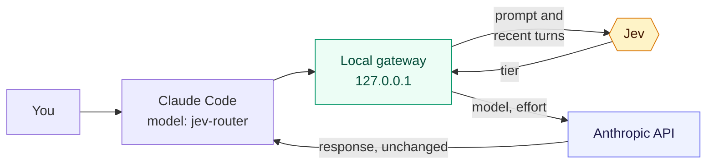
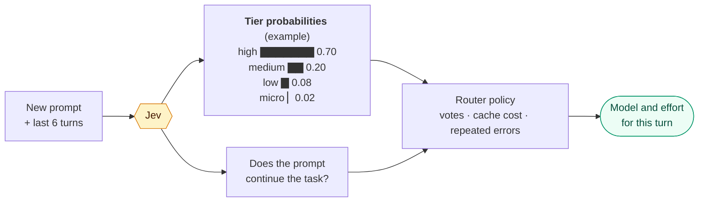

# claude-router

[](https://github.com/alexei-led/claude-router/actions/workflows/ci.yml)
[](https://www.npmjs.com/package/@alexeiled/claude-router)
[](https://opensource.org/licenses/MIT)
[](https://nodejs.org/)

**jev-router for Claude Code: the right model and effort for each turn.**

Easy work goes to Sonnet or Haiku. Hard work goes to Opus. You do not change
models by hand. [Jev](https://typesafe.ai), a small routing model from
TypeSafe, reads each new prompt and advises the tier.

> **Status: experimental.** The data below comes from one developer. Try it,
> and open an issue with your results.

## Why use it

- **Opus where it matters.** In a day of real work, 86.5% of the requests ran
  on Sonnet or Haiku. Opus served the hard 13.5%.
- **15% less than Opus for everything.** The same work at list prices cost
  $141 with the router and $166 with Opus at xhigh effort for each request.
- **Less than the best manual choice.** A user who knows the strongest model
  that each session needs pays $147. The router pays $141.
- **No switches by hand.** You work in Claude Code as usual. When you want a
  fixed tier, pin it: `/router:high`.


The baselines use the same tokens as the router. They get the cache reads of
the sessions, and a full cache hit where the router changed models. The
savings are a lower bound, because the baselines keep the output of the
router, and a stronger model writes more. [Evaluation](docs/evaluation.md)
gives the method and the table.

## How it works



A local gateway receives each request from Claude Code. It changes the model,
the effort and the thinking setting. For Haiku, it also limits the output
size. It does not change your prompt, your tools or your history. Prompt
caching and a claude.ai login work as usual.

## How Jev selects a tier



| Tier     | Model and effort          | Jev selects it for                                                    |
| -------- | ------------------------- | --------------------------------------------------------------------- |
| `micro`  | Haiku 4.5, no thinking    | Lookups, trivial edits, one-step mechanical work                      |
| `low`    | Sonnet 5, your effort     | Clear, low-risk coding steps with one obvious approach                |
| `medium` | Opus 5.5, `high` effort   | Features, bug fixes and refactors with interacting constraints        |
| `high`   | Opus 5.5, `xhigh` effort  | Architecture, unclear bugs, security, work where correctness is vital |

The router tells Jev to put correctness before cost, and not to judge by prompt
length, language or single topic words. The router then keeps the choice
stable:

- Tool calls in a turn keep the model of the turn, so the cache stays warm.
- A switch up needs two votes, or one confident vote for a jump of two tiers.
  A larger cache write needs more confidence.
- If the same error comes back after a fix, the route goes one tier up.
- If Jev fails or is slow, the current route stays.

Jev receives the prompt and the text of the last six turns, up to 1,200
characters each. It does not receive tool results or your system prompt.

## Install

You need Claude Code, Node.js 22 or later, and a Jev API key from
[typesafe.ai](https://typesafe.ai).

1. Add the marketplace and install the plugin:

   ```sh
   claude plugin marketplace add alexei-led/claude-router
   claude plugin install router@alexei-led-claude-router
   ```

2. When Claude Code asks, enter the Jev API key. The key goes to the macOS
   Keychain.
3. In Claude Code, run `/router:setup`. It sets the model and the gateway
   address, and it can add the route to your status line.
4. Restart Claude Code.

The status line shows the route of each turn, for example
`jev-router ▸ opus-5-5 · xhigh · upgrade`. For more detail, run
`/router:status`.

## Documentation

- [User guide](docs/user-guide.md): daily use, pins, the decision log, troubleshooting, updates.
- [Configuration](docs/configuration.md): models, tiers and policy settings.
- [Architecture](docs/architecture.md): the gateway, the switching policy, the cache and cost model.
- [Evaluation](docs/evaluation.md): the method and the numbers behind the chart.
