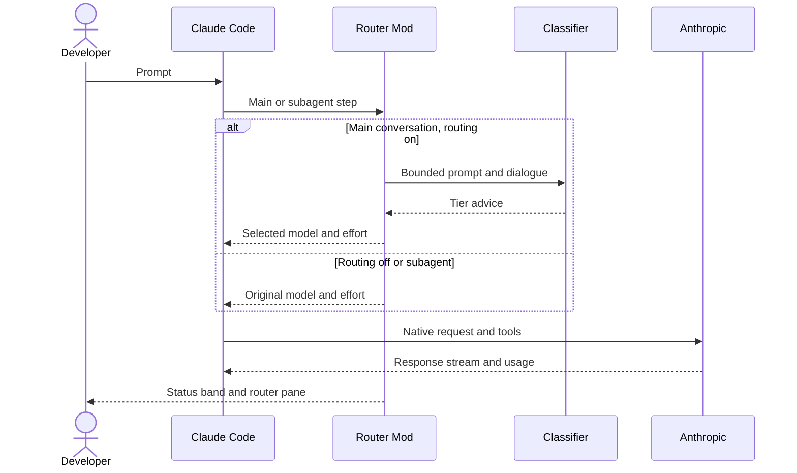

# Claude Model Router

[](https://github.com/alexei-led/claude-router/actions/workflows/ci.yml)
[](https://opensource.org/licenses/MIT)

**A Claude Code Mod that chooses a model and effort for each main-conversation turn, advised by a prompt classifier: Jev, Cloudflare's Clef and Clef Flash, OpenAI, or a local Ollama model.**

The Mod changes only the model and effort in Claude Code's turn hook. Claude Code sends the request, streams the reply, runs tools, and reports usage. The router does not proxy Anthropic traffic or start a local server; an Ollama classifier calls an Ollama server that you run. Subagent model choices pass through unchanged.

## Supported classifiers

The active classifier is asked once per logical turn, for the tier and for the turn's activity. Pick one on the pane's **Classifier** tab or in `router.json`; only the active one receives prompt text.

| Classifier | Service                                    | Credential                          | Prompt text goes to       | How it is asked for the activity                                      |
| ---------- | ------------------------------------------ | ----------------------------------- | ------------------------- | --------------------------------------------------------------------- |
| Jev        | [typesafe.ai](https://typesafe.ai)         | Jev API key                         | typesafe.ai               | A third `choice` question in the same request                         |
| Clef       | Cloudflare Workers AI, 27B                 | Cloudflare API token and account ID | Cloudflare                | The same                                                              |
| Clef Flash | Cloudflare Workers AI, 9B                  | Cloudflare API token and account ID | Cloudflare                | The same                                                              |
| OpenAI     | OpenAI, `gpt-6-luna` (public beta)         | OpenAI API key                      | OpenAI (`api.openai.com`) | A second `choice` in `questions`, in the same request                 |
| Ollama     | A local [Ollama](https://ollama.com) model | None                                | Stays on this machine     | A second request: letters A to H, one token, if 300 ms or more remain |

Jev is the default. [Configuration](docs/configuration.md#classifiers) gives the endpoints, timeouts, and how to add another service that speaks one of the supported protocols.


The band above the prompt shows the tier, activity, model, and reason for each turn. `/router` opens a pane to pin a tier, edit the model and effort of each tier, and tune the policy. See the [user guide](docs/user-guide.md#read-the-status-band).

The router needs Claude Code 2.1.289 or newer. Current savings are not measured. The panel shows Claude's reported usage and configured-price scenarios, not a savings total. See the [evaluation](docs/evaluation.md).

## How it works


```mermaid
sequenceDiagram
  actor Dev as Developer
  participant Code as Claude Code
  participant Mod as Router Mod
  participant Cls as Classifier
  participant API as Anthropic
  Dev->>Code: Prompt
  Code->>Mod: Main or subagent step
  alt Main conversation, routing on
    Mod->>Cls: Bounded prompt and dialogue
    Cls-->>Mod: Tier advice
    Mod-->>Code: Selected model and effort
  else Routing off or subagent
    Mod-->>Code: Original model and effort
  end
  Code->>API: Native request and tools
  API-->>Code: Response stream and usage
  Mod-->>Dev: Status band and router pane
```

The active classifier labels a new logical turn once. Tool continuations keep that choice. A local policy applies vote, context, failure, and cache-cost rules before the Mod changes the next step. Claude Code owns request construction, model credentials, tools, streaming, and the API cost ledger.

| Tier     | Default model | Effort   |
| -------- | ------------- | -------- |
| `micro`  | Haiku 5.5     | `medium` |
| `low`    | Haiku 5.5     | `high`   |
| `medium` | Opus 5.5      | `medium` |
| `high`   | Opus 5.5      | `xhigh`  |

These are routing defaults. They do not claim equal model quality. [Configuration](docs/configuration.md#built-in-defaults) gives the published results behind them and the `router.json` lines that restore the 1.3 Sonnet ladder.

Activity routing adds a second label: what the turn produces (`code`, `debug`, `explore`, `plan`, `review`, `ops`, or `docs`). A route is then picked by tier and activity, so a `low` coding turn can run on Sonnet 5.5 while a `low` git turn stays on Haiku 5.5. It ships in `shadow` mode: the band and pane show the activity and what it would route, and the tier routes still run. Opt in with `/router activities on`. The label is optional: on `uncertain` or a weak label the tier route is used, and when the classifier or its activity answer fails the running route stays. See [Route by activity](docs/user-guide.md#route-by-activity), and [Evaluation](docs/evaluation.md#activity-routing) for how it is checked. Its default overrides rest on published vendor results, not measured savings.

## Install

You need Claude Code 2.1.289 or newer and credentials for one [supported classifier](#supported-classifiers).

```sh
claude plugin marketplace add alexei-led/claude-router
claude plugin install router@alexei-led-claude-router
```

Start Claude Code on the full baseline model, for example `claude --model claude-haiku-5-5`. Run `/plugin configure router` and save the key. For any other classifier, save its credentials, or run `ollama serve` with a pulled model, then pick the classifier on the pane's Classifier tab. A new session on a model that one of the tiers routes to starts with routing on; on another model it starts with routing off and says why, and `/router auto` turns routing on.

Claude Code updates the plugin at startup when auto-update is on for this marketplace. Otherwise run `claude plugin marketplace update alexei-led-claude-router`, then `claude plugin update router@alexei-led-claude-router`.

Upgrading from 0.8? Remove the gateway settings that 0.8 `/router:setup` wrote before the first 1.0 session, or requests go to a gateway that 1.0 no longer starts. Follow the [migration steps](docs/user-guide.md#move-from-v08-gateway-setup).

## Run from a checkout

Start Claude Code with this directory as a local plugin and the full Haiku baseline model:

```sh
claude --plugin-dir "$PWD" --model claude-haiku-5-5
```

In Claude Code, run `/plugin configure router` and save your classifier key in the sensitive plugin option. The Mod adds its status band and `/router` pane. No status-line setup or gateway environment variables are needed.

Run `/router` to open the pane: route status, per-tier controls, tuning, and usage. Run `/model` to select a model and turn routing off, and `/router auto` to turn it back on. For controls, metrics, tuning, and troubleshooting, see the [user guide](docs/user-guide.md).

Before a push, run the same checks as CI. `npm run setup` installs Biome and TypeScript into `tools/`; the plugin root keeps no lockfile, so Claude Code installs nothing with the plugin. `npm run validate` and `npm run test:plugin` need the `claude` CLI: they load the Mod in the Claude Code engine, which refuses some faults that lint and unit tests miss.

```sh
npm run setup
npm run check && npm run typecheck && npm test && npm run validate && npm run test:plugin
```

## Documentation

- [User guide](docs/user-guide.md): install, use the controls, read the panel, and troubleshoot.
- [Configuration](docs/configuration.md): classifiers and keys, the optional profile `router.json`, defaults, and migrations.
- [Architecture](docs/architecture.md): Mod event flow, state, safeguards, and runtime boundaries.
- [Native router details](docs/native-router.md): panel semantics, tuning, and accepted limits.
- [Evaluation](docs/evaluation.md): historical gateway results and the native shadow replay.
- [Changelog](CHANGELOG.md): user-visible changes by version.
