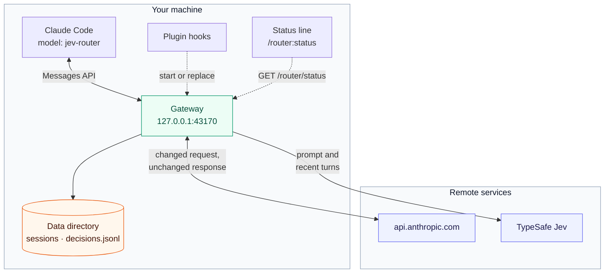
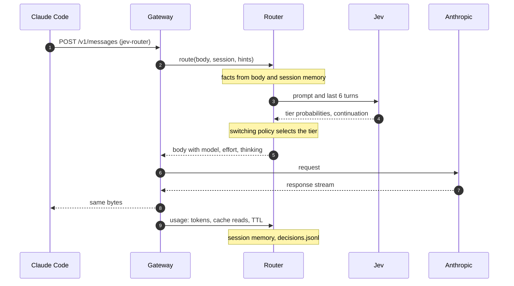
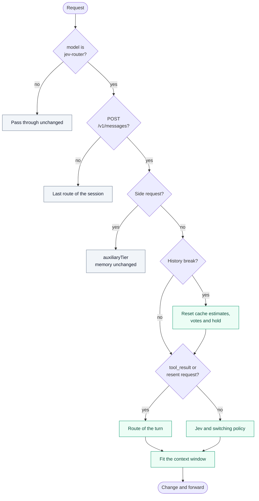
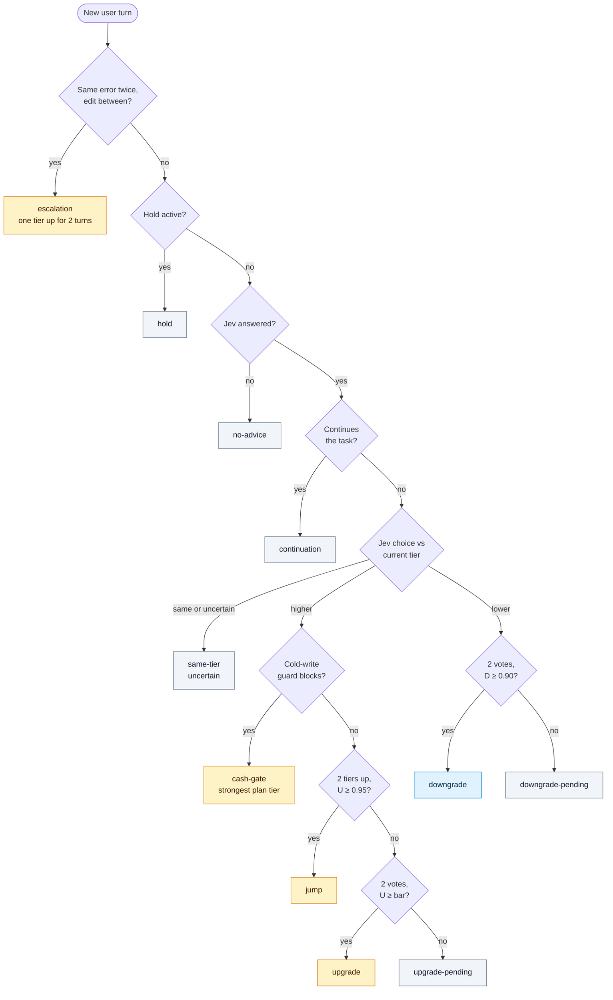
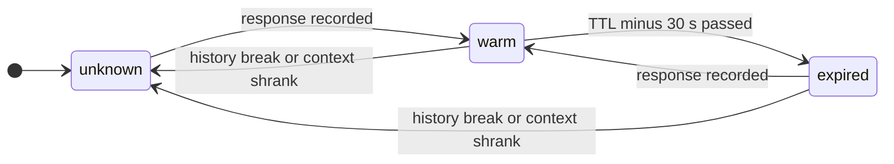
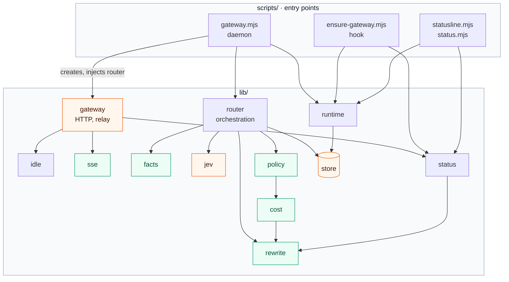
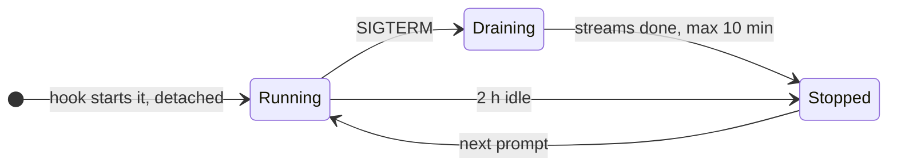
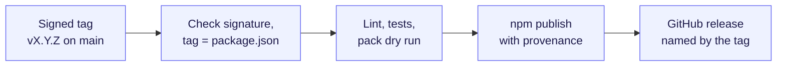

# Architecture

claude-router selects a model and an effort level for each Claude Code turn.
A local gateway changes each request before it goes to Anthropic. TypeSafe Jev
advises a tier, and a local policy makes the decision.

- [System context](#system-context)
- [Tiers](#tiers)
- [Request flow](#request-flow)
- [Request classes](#request-classes)
- [Switching policy](#switching-policy)
- [Cache and cost model](#cache-and-cost-model)
- [Modules](#modules)
- [Gateway lifecycle](#gateway-lifecycle)
- [Failure handling](#failure-handling)
- [Security and privacy](#security-and-privacy)
- [Observability](#observability)
- [Release](#release)
- [Known limits](#known-limits)

## System context



- `/router:setup` points `ANTHROPIC_BASE_URL` at the gateway and sets the
  model to `jev-router[1m]`. One gateway serves all sessions on the machine.
- The gateway changes only requests for the alias. It sets `model`,
  `output_config.effort` and `thinking`. For a small model, it also limits
  `max_tokens` and removes the 1M context beta header and the thinking edits.
- The gateway never changes `system`, `tools` or `messages`. Prompt caching
  and a claude.ai login work as with a direct connection.
- Responses go back unchanged. The gateway reads `usage` from them.

**Why a gateway.** The `model:` frontmatter of a skill changes the model only
when the user types the skill. When Claude calls the same skill, the session
model answers. The tier skills are therefore manual pins, and only a gateway
can route every turn.

## Tiers

Four tiers, from `micro` (Haiku) to `high` (Opus at `xhigh`), map to a model
and an effort. The [README](../README.md#how-jev-selects-a-tier) shows the
work that Jev selects each tier for. The [routes](configuration.md#routes)
set the mapping.

- `low` is the baseline.
- `medium` and `high` use the same model at two efforts.
- The gateway lowers an effort to a level that the model accepts. Haiku
  accepts no effort, so it runs without thinking.

## Request flow

A new user turn:



A tool continuation and a resent request skip the Jev call. They keep the
route of their turn.

## Request classes



| Check           | How the gateway decides                                                                                                                                                  |
| --------------- | ------------------------------------------------------------------------------------------------------------------------------------------------------------------------ |
| Pass through    | Any other model: `/router:<tier>` pins, `/model`, subagents with their own model.                                                                                        |
| Not a turn      | `count_tokens` and other endpoints get the last route of the session.                                                                                                    |
| Side request    | Header `x-claude-code-request-class` is `auxiliary` or `compaction`. Without the header: thinking disabled or an output format in the body.                               |
| History break   | Fewer messages than the last main request (a compaction or a rewind), or the header `x-claude-code-context-compacted`.                                                     |
| Resent request  | Same message count and same last message. Claude Code resends after a 429, a 529 or a dropped stream. No Jev call, no vote.                                              |
| Context fit     | The route moves to a model whose window holds the next context at 80% fill. Reason `context-fit`.                                                                        |
| Session memory  | Key `x-claude-code-session-id`. A subagent adds its agent id: `<session>.<agent id>`. Its turns do not change the route of the main conversation.                          |

## Switching policy



Each box is the `reason` that the log and the status line show. Grey boxes
keep the current route. The cold-write guard serves the strongest plan tier
only when that tier is above the current route.

- `U` is the Jev probability mass above the current tier. `D` is the mass at
  or below the candidate. The `uncertain` mass supports neither.
- The upgrade bar grows with the switching tax:
  `bar = 0.75 + 0.15 × tax / (tax + $0.50)`. It stays between 0.75 and 0.90.
- A prompt continues the task when the Jev continuation answer is 0.7 or
  more. A continuing prompt never votes for a downgrade.
- A downgrade has no tax term.
- Upgrades have no cooldown. Plan, then execute, then hard work again is a
  valid sequence.
- A failure signal is two `tool_result` errors with the same text and an edit
  between them, in the last 40 messages. Each signal escalates once.
- The thresholds are defaults in [configuration](configuration.md#policy).

## Cache and cost model

The gateway keeps one cache record for each model and effort, for example
`claude-opus-5-5@xhigh`. A change of effort replaces the cached messages, so
`medium` and `high` are two caches.



The switching tax compares the input cost of the next request on the
candidate and on the current route:

```text
input_cost = P_read × W + P_write × (N − W)
tax        = max(0, input_cost(candidate) − input_cost(current))
```

| Symbol    | Source                                                                                                  |
| --------- | ------------------------------------------------------------------------------------------------------- |
| `N`       | Next context: tokens and output of the last response.                                                   |
| `W`       | Warm prefix of the candidate cache. Zero when the cache is `expired` or `unknown`.                      |
| `P_read`  | List price for cache reads.                                                                             |
| `P_write` | Input list price × 1.25 (5-minute TTL) or × 2 (1-hour TTL). The TTL comes from `usage.cache_creation`. |

- **Upper bound.** An effort change counts the whole prefix as lost. On some
  models, the tools and the system prompt stay in the cache.
- **Context editing.** A context that shrinks by more than 20% with no fewer
  messages resets the cache records only. The votes stay.
- **Cold-write guard.** A model with `billing: "credits"` bills cash. When its
  cache is not warm, `policy.cashCapUsd` limits the first cache write. It is
  not a budget for the turn. No default model bills credits.
- **Prices.** List prices in USD per million tokens. For plan models, the
  dollars only give an order between models. A test pins the defaults to
  `test/fixtures/list-prices.json`, which names its source and date.
- **Shadow estimate.** When the Jev choice differs from the current route, the
  log records the cost of the next turn, the cost of each later turn with
  output, and the turns until a switch repays its cost. The policy does not
  read it.

## Modules



Green modules are pure functions. Orange modules do I/O: `gateway` serves
HTTP, `jev` calls Jev, and `store` is the only module that writes files. The
Jev transport and the router are injected, so tests run without a network.
All modules read `config.mjs`.

| Module    | Responsibility                                                              |
| --------- | --------------------------------------------------------------------------- |
| `gateway` | HTTP server, loopback checks, relay with `pipeline()`, status endpoint.     |
| `router`  | One request: class, facts, advice, policy, rewrite, session memory, log.    |
| `facts`   | Prompt, recent turns, continuation, failure signal, resend key.            |
| `jev`     | One bounded Jev request with a Choice (tier) and a Noul (continuation).     |
| `policy`  | Switching policy, context fit, cold-write guard.                            |
| `cost`    | Cache key, warmth, input cost, switching tax, shadow estimate.              |
| `rewrite` | Model, effort, thinking and output limit for each model family.             |
| `sse`     | `usage` from SSE and JSON responses.                                        |
| `idle`    | When the daemon can exit.                                                   |
| `status`  | Status snapshot, status line segment, `/router:status` report.              |
| `store`   | Session memory, `decisions.jsonl`, rotation.                                |
| `runtime` | Configuration file and data directory from the environment.                 |

## Gateway lifecycle



- The `SessionStart` and `UserPromptSubmit` hooks run `ensure-gateway.mjs`.
  It starts a missing gateway and sends `SIGTERM` to an older version. It
  never replaces a newer version.
- On `SIGTERM`, the gateway releases the port at once. A new gateway can
  start while the old one finishes its streams.
- The idle exit waits for two hours without requests. It also waits while a
  request is open or a turn waits for a tool result, for example a
  permission prompt. A waiting turn stops counting after one day.
- A second daemon on a busy port exits quietly.

## Failure handling

| Failure                            | Behavior                                                                                      |
| ---------------------------------- | --------------------------------------------------------------------------------------------- |
| Anthropic 429, 529, 5xx            | Pass through with `Retry-After`. Claude Code owns retries.                                    |
| Upstream reset during a stream     | The client connection resets, and Claude Code retries at once.                                |
| Client leaves (Esc)                | The gateway stops the upstream request.                                                       |
| Jev error or timeout               | One retry inside the 1.5 s budget. Then the current route stays.                              |
| Three Jev failures in a row        | New turns skip Jev for one minute, then try once.                                             |
| Routing error                      | The baseline tier serves. The alias never goes to Anthropic.                                  |
| Disk error                         | Logged. The routing decision stays.                                                           |
| Unexpected exception               | Logged. The daemon continues.                                                                 |

## Security and privacy

- The gateway listens on `127.0.0.1` only. It refuses a non-loopback `Host`
  (DNS rebinding) and a web `Origin` (cross-site requests).
- Jev receives the prompt and the text of the last six turns, 1,200
  characters each. Tool results and system reminders are not sent.
- The Jev key is in the macOS Keychain. The status endpoint shows only whether
  a key is set.
- `decisions.jsonl` has no prompt text.

## Observability

- `GET /router/status?session=<id>` gives the routes and the last turn of a
  session. The status line and `/router:status` read it.
- `decisions.jsonl` has one line for each decision and each response. It has
  no prompt text.
- `gateway.log` has the daemon events.

The [user guide](user-guide.md#read-the-status-line) explains how to read
them. The [data directory](configuration.md#data-directory) gives their
retention.

## Release



- The repository root is the plugin and the npm package
  `@alexeiled/claude-router`.
- Claude Code installs the plugin from Git: the marketplace source is
  `github`. An npm source fails with npm 12 (`EALLOWREMOTE`).
- `claude plugin update` compares the version in `.claude-plugin/plugin.json`.
  Each release changes it together with `package.json`.
- `ci.yml` runs the checks and the tests for each push and pull request.

To work on the code:

```sh
npm install
git config --local core.hooksPath scripts/git-hooks   # Biome, tests and Gitleaks before commit and push
npm test && npm run check                             # node:test, Biome
claude --plugin-dir . --model jev-router              # with ANTHROPIC_BASE_URL and TYPESAFE_API_KEY
```

## Known limits

- The request body does not show the exit from plan mode.
- The thresholds are start values. The `observed` and `shadow` lines in
  `decisions.jsonl` are the input for tuning.
- The gateway reads its configuration once. A change needs a restart.
- Without the hint headers, the gateway guesses side requests. A missed side
  request with a short history counts as a history break.
- `x-claude-code-agent-type` goes to the log only.
- The shadow estimate uses the last output size for both routes, but effort
  changes how much a model writes.

A day of real usage is in [Evaluation](evaluation.md).
