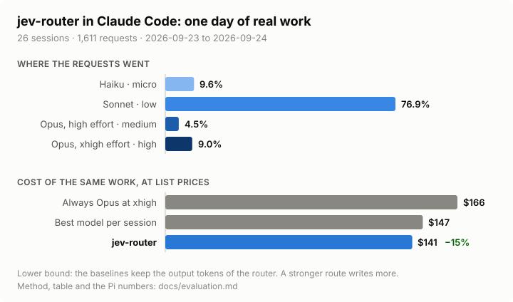

# Architecture

Each decision has the date when the owner took it.

## Goal

Select a model and an effort level for each user turn, from the models that
Claude Code offers, with one TypeSafe Jev Choice. Stay inside the Claude Code
terminal interface.

## Mechanism: local gateway (2026-09-22)

Claude Code runs with `--model jev-router`. `ANTHROPIC_BASE_URL` points at a
gateway on `127.0.0.1`. The gateway sends each request to `api.anthropic.com`
unchanged, except a request whose `model` is the alias. For that request, the
gateway reads facts from the body, asks Jev once for each new user turn, runs
the policy, and changes `model`, `output_config.effort` and `thinking`.
Responses go through unchanged. The gateway reads `usage` from the response to
get the context size, the cache reads and the cache TTL.

For a model without thinking (Haiku), the gateway also removes the
`clear_thinking_*` edits from `context_management`, because the API rejects
them without thinking. The gateway never changes `system`, `tools` or
`messages`. Thinking and prompt caching work as if Claude Code talked to
Anthropic directly. Claude Code documents this gateway mode, including the
OAuth value for a claude.ai login. See
[llm-gateway](https://code.claude.com/docs/en/llm-gateway) and
[protocol](https://code.claude.com/docs/en/llm-gateway-protocol).

Module dependencies point in one direction: `gateway.mjs` (HTTP) →
`router.mjs` (orchestration) → `facts`, `jev`, `policy` → `cost`, `rewrite`,
`store`. The modules `facts`, `cost`, `rewrite`, `sse` and `policy` are pure.
Only `store` writes files. The Jev transport is injected.

The `SessionStart` hook of the plugin starts the gateway when the port does not
answer. `/router:setup` writes `model`, `ANTHROPIC_BASE_URL` and the picker row to
the user settings once. A plugin cannot set them by itself.

The gateway serves `GET /router/status?session=<id>`: the routes and the last
turn of the session, never the key. `/router:status` and the status line
wrapper read it. Claude Code shows only the alias as the model, so the wrapper
is the only place where the real model of the turn is visible.

### Why not the native skill path

The first design used a `UserPromptSubmit` hook that asked Claude to call a
tier skill, relying on the skill's frontmatter `model:` and `effort:` to serve
the rest of the turn. On Claude Code 2.1.278 that only works for a skill the
user types (`/router:medium …`); the same skill called by Claude through the
Skill tool does not change the model — the transcript records
`attributionSkill`, but the session model answers. So `/router:<tier>` skills
stay as manual pins, and the gateway is the only path that routes turns Claude
calls on its own.

## Tiers

| Tier   | model  | effort  | id sent to Anthropic |
| ------ | ------ | ------- | -------------------- |
| high   | opus   | xhigh   | claude-opus-5-5      |
| medium | opus   | high    | claude-opus-5-5      |
| low    | sonnet | as sent | claude-sonnet-5      |
| micro  | haiku  | none    | claude-haiku-4-5     |

The gateway lowers the effort to a level the model's `efforts` list accepts
(see [configuration](configuration.md#models)); Haiku accepts none, so it gets
no effort and no adaptive thinking. The ids are configuration.

## Request classes

- New user turn (the last message has no `tool_result`): Jev and the policy.
- Tool continuation: the route of the turn, without a Jev call.
- The classes `auxiliary` and `compaction` from the header
  `x-claude-code-request-class`: `auxiliaryTier`, and the memory stays
  unchanged. `main`, `subagent` and `workflow` get routing. Without the header,
  a body with `thinking: disabled` and a `format` is a side request.
- A subagent (header `x-claude-code-agent-id`): routing with its own memory,
  under the key `<session>.<agent id>`. The main conversation keeps its route.
- Any other `model`: unchanged. This covers `/router:<tier>` pins,
  `/model` changes and subagents with their own model.
- A resent request (the same history length and the same last message): the
  route of the turn, without a Jev call or a vote. Claude Code resends after a
  429, a 529 or a dropped connection.
- A side endpoint with the alias, such as `/v1/messages/count_tokens`: the
  model of the session's last route. Only `POST /v1/messages` is a turn.
- A history break: a main request with fewer messages than the last one (a
  compaction or a rewind), or the header `x-claude-code-context-compacted`.
  The gateway drops the cached prefixes, the votes and the escalation hold,
  then routes the request as usual. The route stays until the next decision.

## Failure handling

One gateway serves every Claude Code session on the machine, so a failure in one
request must not reach the others.

- Anthropic errors (429, 529, 5xx) pass through unchanged, with `Retry-After`.
  Claude Code owns retries and backoff; a second retry layer in the gateway
  would multiply attempts and cannot replay a stream that has started.
- The response is relayed with `pipeline()`. An upstream reset destroys the
  client response, so Claude Code sees a reset and retries at once. A client
  that leaves (Esc) destroys the upstream request, so the model stops
  generating an answer that nobody reads.
- Disk errors while the gateway saves session memory or the decision log are
  logged. The routing decision stands.
- Jev: one retry on a network error or a transient status, after
  `Retry-After` when it fits the 1.5 s budget. After three failures in a row,
  new turns skip Jev for a minute, then try once per pause.
- The daemon logs a stray exception instead of exiting. On `SIGTERM` it
  releases the port at once and finishes open streams for up to 10 minutes.
  A second daemon on a busy port exits quietly.
- The `SessionStart` and `UserPromptSubmit` hooks start the gateway when the
  port does not answer, and replace a gateway older than the plugin. They never
  replace a newer one.
- The gateway exits after `gateway.idleShutdownMs` (two hours) without
  requests. Claude Code holds no connection open between requests, so the
  gateway cannot tell a closed session from an idle one; time is the signal.
  Two cases keep it running: a request in flight, and a turn whose last
  response asked for a tool (`stop_reason: tool_use`), such as an unanswered
  permission prompt. The answer to that prompt reaches the gateway without a
  new prompt, so without the hook that would start it again. A session that
  died mid-turn stops counting after a day. Two hours outlast `/loop` wakeups
  and Monitor waits, which also arrive without a prompt.
- The gateway refuses requests with a non-loopback `Host` (DNS rebinding) or a
  web `Origin` (cross-site requests from a browser).

## Cache and cost inputs

All inputs come from the traffic of the gateway. The gateway does not read
transcripts.

| Input                                            | Source                                                                                                                                                                   |
| ------------------------------------------------ | ------------------------------------------------------------------------------------------------------------------------------------------------------------------------ |
| Context of the last request, cache reads, output | `usage` in the response (`message_start` and `message_delta`)                                                                                                            |
| Granted TTL                                      | `usage.cache_creation.ephemeral_1h_input_tokens` or the `5m` field                                                                                                       |
| Cache identity                                   | The model id and the effort the gateway sent (`claude-opus-5-5@xhigh`). An effort change rewrites the messages cache, so each effort is its own cache.                  |
| Cache warmth                                     | The time of the last response for that cache, plus the TTL, minus 30 s. `unknown` when no response since the session started or the history broke.                      |
| Reusable prefix                                  | The context plus the output at the last response for that cache. Cleared by a history break, or when the context shrinks by more than 20% (context editing).             |
| Failure signal                                   | Two `tool_result` blocks with `is_error` and the same signature, with an edit tool call between them                                                                     |
| Continuation                                     | The last message contains a `tool_result`. For a new prompt, a Jev Noul answers "does this prompt continue the task".                                                    |

Prices are a list-price table in the configuration (see
[configuration](configuration.md#models)). `modelPricing` is a managed setting
and is not readable. The switching tax for a candidate `c` against the current
route `i` is:

```
input_cost(m) = P_read(m) * W_m + P_write(m) * (N - W_m)
tax = max(0, input_cost(c) - input_cost(i))
```

The subscription economics are not symmetric. Every default model uses the plan
limits, and dollars give the order between them. A model with `billing:
"credits"` bills cash, on the 5m TTL, and behind the gateway without the
consent prompt of Claude Code. `policy.cashCapUsd` is a cold-write guard: it
caps the estimated first cache write of an automatic route to such a model
when its cache is not warm. It is not a budget: a warm cache passes, and
output is not counted. A Claude Code turn starts at about 100k tokens (system
prompt and tool definitions), so the guard binds on the first switch, not
later. No default model bills credits; the guard stays for configurations that
add one.

## Switching policy v0

Agreed with Codex on 2026-09-22. The thresholds are start values.

1. Pins win. A request for a real model id goes through unchanged.
2. To stay is a decision. The current route is the route that served the last
   turn. A prompt that continues the task keeps it and never votes for a
   downgrade.
3. Escalation floor. Two failed repairs of the same failure signature, with an
   edit between them, move the route one tier up. The route holds for two
   turns, once for each signature.
4. Votes keep the Jev probabilities. `U` is the mass above the current tier.
   `D` is the mass at or below the candidate. The `uncertain` mass supports
   neither. An upgrade needs two consecutive votes above the current tier and
   `U >= 0.75 + 0.15 * tax / (tax + 0.5)`. A jump of two tiers with
   `U >= 0.95` skips the delay. A downgrade needs `D >= 0.90` and two
   consecutive votes.
5. Cold-write guard (reason `cash-gate`). An automatic route to a `credits`
   model needs a warm cache, or a cold write below the cap. Otherwise the
   strongest `plan` tier serves.
6. No cooldown on upgrades. Plan, then execute, then hard again is sometimes
   the correct routing. The log separates reversals from real changes in the
   required capability.
7. Logs. The tier, the reason, the estimates, and the observed model, tokens
   and cache reads of each routed response. The memory changes only from
   responses that the gateway sent.

## Cache identity, history breaks and shadow economics (2026-09-23)

From a design review with the architect of pi-model-router, the Pi router
that uses the same Jev tiers.

- Cache identity is the model and the effort. A top-level effort change
  invalidates the messages cache; the cache-preserving per-message effort is
  not available on Opus 5.5. Before 0.6.1 the key was the model alone, so
  `medium` ↔ `high` (Opus at `high` and `xhigh`) looked like a free switch
  between warm caches.
- A history break (fewer messages, or the compaction header) drops the cached
  prefixes, the votes and the escalation hold: they were about turns that are
  gone. Context editing shrinks the context but keeps the messages; it drops
  only the prefixes. The gateway has no branch id, so it does not restore state
  from before a rewind; `unknown` is the honest cache state after one.
- `/router:status` and the status line show the reason; the report adds the
  estimate. The dollars are list prices, a list-price equivalent for plan
  models.
- Shadow economics in `decisions.jsonl`, not read by the policy: for a turn
  where Jev's choice differs from the current route, the extra cost of the
  next turn, the difference for each later turn (input and output), and the
  turns until a cheaper route repays its cache write. The owner's first
  request (2026-09-22) was to stay while the model works on a warm cache and
  to step down once the thinking is done. Rule 2 covers the first half; the
  shadow estimate measures the second before any rule acts on it.
- The default prices match `test/fixtures/list-prices.json`, which names its
  source and date. A test pins how a tenfold cache-read error changes one
  decision: the bar moves within `upgradeBase` and `upgradeBase +
  upgradeSlope`, and a confident jump ignores it. That error happened once
  (a838f7c).

Not taken: the agent type as a routing signal; a payback check on downgrades
before shadow data; removing the switching tax from the upgrade bar before a
replay of the logs. The Pi router rejects the tax-to-confidence formula
because it mixes dollars with an uncalibrated probability; the replay decides.

## Real-world evaluation (2026-09-23)

A day of dogfooding this repository on the installed plugin: 31 Claude Code
sessions, 1,578 routed requests, one machine. `decisions.jsonl` holds the
tier, the reason and the token counts for every request — no prompt text.



82% of turns never needed more than Sonnet, 10% stayed on Haiku, and 8% needed
Opus. `medium` (Opus at `high` effort) fired once: a confident vote jumps two
tiers straight to `high` instead of stopping at `medium` (switching policy,
rule 4).

Repricing that same traffic — same tokens, same observed cache reads — at
Opus's rates puts the input-token bill 18.8% above what the router actually
spent. That number covers input tokens only: the price table has no output
price (see [Cache and cost inputs](#cache-and-cost-inputs)), so it cannot say
how much of the real saving is left out — likely more, since Haiku and Sonnet
also bill less per output token than Opus. Answer quality isn't measured
here either.

One developer, one day: a dogfood snapshot, not a benchmark.

## Layout

```
  .claude-plugin/plugin.json   userConfig.typesafe_api_key (Keychain)
  .claude-plugin/marketplace.json  github source alexei-led/claude-router
  hooks/hooks.json             SessionStart -> scripts/ensure-gateway.mjs
  scripts/gateway.mjs          daemon entry
  scripts/ensure-gateway.mjs   port probe, detached spawn
  scripts/statusline.mjs       status line wrapper: wrapped command, then the route
  scripts/status.mjs           report for /router:status
  scripts/transcript-models.sh model for each assistant line of a transcript
  lib/runtime.mjs              configuration and data directory from the environment
  lib/config.mjs               defaults, user file, validation
  lib/facts.mjs                request body and memory -> facts (pure)
  lib/jev.mjs                  request, injected transport, parse
  lib/cost.mjs                 cache key, warmth, input cost, switching tax, shadow economics
  lib/policy.mjs               switching policy v0
  lib/rewrite.mjs              model, effort, thinking per model family
  lib/sse.mjs                  usage reader for SSE and JSON bodies
  lib/router.mjs               orchestration for one request, session memory
  lib/gateway.mjs              HTTP passthrough and rewrite
  lib/store.mjs                files: configuration, memory, decisions.jsonl
  lib/status.mjs               status snapshot, status line segment, report
  skills/<tier>/SKILL.md       manual pins (model and effort frontmatter)
  skills/setup/SKILL.md        writes model, base URL, picker row, status line
  skills/status/SKILL.md       /router:status
  test/                        node:test, builders in helpers.mjs
```

## Open questions

- The exit from plan mode is not visible in the request body. The policy has
  no boundary rule.
- The thresholds are not tuned. The estimated and the observed cache reads in
  `decisions.jsonl` are the input for the tuning.
- The gateway reads the configuration once. A reload without a restart is not
  implemented.
- Without `CLAUDE_CODE_GATEWAY_HINT_HEADERS=1`, the gateway guesses side
  requests from the body; the guesses miss some. A missed side request with
  a short history also counts as a history break.
- `x-claude-code-agent-type` is logged, not used: no policy rule reads it yet.
- Does a downgrade that the shadow estimate says never repays deserve a rule,
  and does the switching tax belong in the upgrade bar? A replay of
  `decisions.jsonl` against the `shadow` and `observed` lines decides.
- Effort changes how much a model writes. The shadow estimate uses the last
  output size for both routes.
- Whether tools and system survive an effort change is model-specific; the
  gateway counts the whole prefix as lost, an upper bound.

## Release

The repository root is the plugin and the npm package `@alexeiled/claude-router`.
The marketplace `alexei-led-claude-router` in `.claude-plugin/marketplace.json`
points at this GitHub repository (`"source": "github"`), so Claude Code installs the
plugin from git and never calls npm. An npm source
fails under npm 12: Claude Code fetches the tarball URL, and npm 12 refuses
remote tarballs by default (`EALLOWREMOTE`). `claude plugin update` compares
the `version` in `.claude-plugin/plugin.json`, so each release bumps it. Local
development uses `claude --plugin-dir .`.

A release is a signed annotated tag `v<version>` on `main`, where the version
matches `package.json`. The `release.yml` workflow makes sure that the tag is
signed and on `main`, runs the checks and the tests, publishes to npm with
trusted publishing (`npm publish --provenance`, no token), and creates the
GitHub release. The `ci.yml` workflow runs the checks and the tests for each
push and pull request on `main`.
