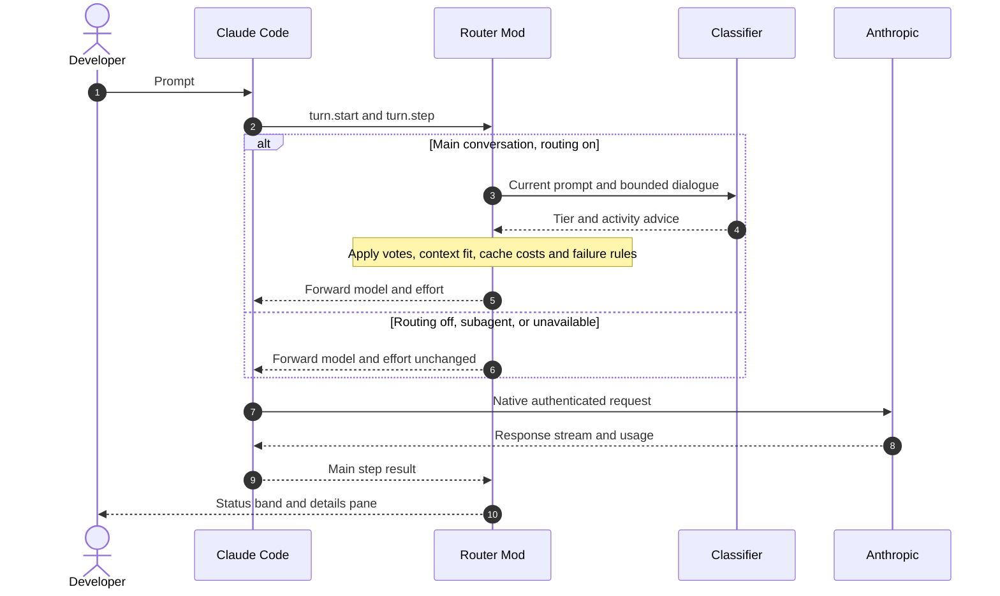

# Architecture

Claude Code owns the model request. The router Mod asks the active classifier (Jev by default; Cloudflare's Clef or Clef Flash; OpenAI; or a local Ollama model) for tier advice and, unless `activityRouting` is `off`, the turn's activity, applies local routing policy, and changes only the next main-conversation step's model and effort. Every subagent step passes through with Claude's model selection unchanged.

## Request flow

```mermaid
sequenceDiagram
    autonumber
    actor Dev as Developer
    participant Code as Claude Code
    participant Mod as Router Mod
    participant Cls as Classifier
    participant API as Anthropic
    Dev->>Code: Prompt
    Code->>Mod: turn.start and turn.step
    alt Main conversation, routing on
        Mod->>Cls: Current prompt and bounded dialogue
        Cls-->>Mod: Tier and activity advice
        Note over Mod: Apply votes, context fit, cache costs and failure rules
        Mod-->>Code: Forward model and effort
    else Routing off, subagent, or unavailable
        Mod-->>Code: Forward model and effort unchanged
    end
    Code->>API: Native authenticated request
    API-->>Code: Response stream and usage
    Code-->>Mod: Main step result
    Mod-->>Dev: Status band and details pane
```

The Mod does not construct an Anthropic request or proxy its response. Claude Code owns authentication, request fields, streaming, tools, model fallback, and its native usage ledger. No local gateway process or port is part of the runtime. The Ollama classifier calls an Ollama server that you run; the Mod starts none.

The active classifier receives only the current prompt and up to six recent user or assistant text messages. Each text is capped at 1,200 characters. System messages, tool inputs, and tool results are not included. Only the active classifier is asked: Jev sends that text to typesafe.ai, Clef and Clef Flash to Cloudflare Workers AI, OpenAI to api.openai.com. Ollama runs on this machine, so the text stays here. The Jev, Cloudflare, and OpenAI keys are sensitive plugin options; the Cloudflare account ID is a plain one that fills the endpoint. Ollama takes no key. The Mod does not receive Claude's Anthropic credentials.

Each classifier names its wire protocol, `api`, and `classifier-apis.mjs` holds one adapter per protocol. `system-one` (Jev, Clef, Clef Flash) sends the typed `state` and `questions` request and reads `answers.route`; Cloudflare's REST API wraps that answer in `{ result, success, errors }`, which the parser unwraps. `openai-decisions` (OpenAI) sends the state as `input` text and reads a `choice` answer plus a `predicate` for the continuation. `ollama` asks for one letter with thinking off and reads the log-probability of each letter from the top 20 candidates. A letter's probability is its share of the letters found there; a letter missing from the list counts as zero. The Ollama adapter asks no continuation question, so `continuation` is null there. Every adapter returns the same advice shape, so the routing policy is unchanged.

The advice also carries `activity`: `{ choice, probabilities }` over the seven activities and `uncertain`, or null. Each protocol asks for it differently:

| Protocol           | How the activity is asked                                                                                                                        |
| ------------------ | ------------------------------------------------------------------------------------------------------------------------------------------------ |
| `system-one`       | A third question, `activity`, of type `choice` in the same request.                                                                              |
| `openai-decisions` | A second `choice` in `questions`, named `activity`.                                                                                              |
| `ollama`           | A second request after the route answer, with the same system message and state prefix so Ollama can reuse its cache. Letters A to H, one token. |

The activity is optional at every layer. An adapter reads a missing, malformed, or unknown activity answer as `activity: null` and keeps the strict parsing of the route answer. With `activityRouting: off` no adapter builds the activity question, so the request bodies are the ones 1.5 sent; a fixture test checks this. The criteria and instructions live in `classifier-contract.mjs` beside the tier ones, and name each activity by what the turn produces. The classifier criteria keep showing the base route of each tier, not the activity overrides: the tier question is about difficulty.

Claude Code builds each request for the model the Mod selects, so no request rewriting is needed: Haiku 4.5 got its own thinking mode and a 32K output cap. On Claude Code 2.1.289, a billed chain of pinned turns (Opus, Haiku 4.5, Sonnet at `xhigh`, Sonnet, Haiku 4.5) used a tool on every turn over the previous models' history, and no request was rejected. Sonnet and Opus accepted histories above 589K input tokens. These checks cover tested requests. They do not prove every Claude Code feature combination.

## Responsibilities

| Component                                             | Responsibility                                                                                                   |
| ----------------------------------------------------- | ---------------------------------------------------------------------------------------------------------------- |
| [Native hooks](../hooks/native-router.mjs)            | Turn identity, controls, lifecycle, per-step rewrites, response observation, pane actions, and every host call.  |
| [Classifier contract](../lib/classifier-contract.mjs) | Route criteria and instructions shared by every protocol, credentials and endpoint filling, and retry rules.     |
| [Classifier APIs](../lib/classifier-apis.mjs)         | One adapter per wire protocol: request payload, answer validation, and the shared advice shape.                  |
| [Classifier client](../lib/classifier-client.mjs)     | Classifier HTTP, deadline, in-flight admission, and circuit breaker.                                             |
| [Router controller](../lib/route.mjs)                 | Context fit, model identity, engine fallback, cache observations, one-turn pins, and the tier-and-activity cell. |
| [Activity rules](../lib/activity.mjs)                 | Which activity applies, how two routes compare, and when a route change inside a tier is worth it.               |
| [Activity stats](../lib/activity-stats.mjs)           | Session and stored activity counts, the tool-agreement table, and the per-turn record.                           |
| [Facts](../lib/facts.mjs)                             | The turn's facts for policy, and the bucket of a finished turn from its tool calls.                              |
| [Policy](../lib/policy.mjs)                           | Tier votes, escalation, and switching gates, for routes as well as tiers.                                        |
| [Costs](../lib/cost.mjs)                              | Cache uncertainty bounds and switching estimates.                                                                |
| [Router view](../lib/view.mjs)                        | The view's initial shape and the usage readings each reply adds to it.                                           |
| [Config file](../lib/config-file.mjs)                 | Pane writes to `router.json`: the validated rewrite and what Undo restores.                                      |
| [Panel](../lib/panel.mjs)                             | Tabbed pane: route status, tier pins, the route editor, tuning, and usage.                                       |
| [Router band](../lib/band.mjs)                        | Status band segments fitted to the band's width, and route-change toasts.                                        |
| Claude Code                                           | API requests, tools, authentication, stream output, and usage ledger.                                            |

Every function that takes the engine interface `$` lives in the hooks module: the engine does not follow `$` across an import, so the modules in `lib/` stay pure.

Node.js is not part of routing. It is used for development, the optional configuration migration, and the classifier probe.

## Decision and context

One logical turn gets one classification. Tool continuations reuse the decision and add no votes. Before each step, the controller checks whether the selected model still fits after new tool output.

An upgrade or downgrade needs a streak of supporting votes (`upgradeVotes`, `downgradeVotes`), because staying keeps a warm cache. Before the first measured reply of a history (session start, clear, rewind, committed compaction), no cache from it exists yet, so one vote is enough. The mass bars, the cash gate, escalation, holds and continuations apply as usual.

A move to a smaller context window needs a main-response measurement from the current history and Claude's local context estimate. The router uses the larger available reading and reserves 20% of the model window. If it cannot establish fit, it keeps the current model with `context-unknown`. It does not infer token count from character count.

An explicit context-window failure marks that model ineligible until the next history reset. An engine fallback suspends rewriting for the rest of the turn. The router does not retry an Anthropic request.

## Activity routing

The router decides on a *cell*: a tier and an activity. The route is `{ ...routes[tier], ...activities[activity][tier] }`; the (model, effort) pair, not the label, is what Claude Code receives and what owns a cache. Two cells that resolve to the same route never switch.

`chooseRoute` runs one decision per logical turn:

1. **Pin.** A pinned tier wins, with no activity: the pin's tier route.
2. **Activity.** Only in `on`; `off` and `shadow` use none for the route they apply, and ignore the activity a turn in `on` ran with before the mode changed. With no advice, or advice without an activity answer, the incumbent's activity stays. On a new prompt the classifier scores as a continuation of the task (advice `continuation` at or above `continuationMass`; Ollama gives none), the advice's activity applies only if its route at the incumbent tier is stronger than the running route, so a task can move from `explore` up to `code` but a weaker label never takes over. Tool continuations inside a turn do not reclassify: they keep the turn's route and activity. Otherwise the activity with probability at least `activityMass` applies; below that, or for `uncertain`, there is none and the tier's base route is used.
3. **Tier.** The tier policy runs as before, with every candidate tier priced at its route for the activity and the incumbent at the route it runs. Repeated tool errors move to the lowest tier above whose route is stronger than the running one, or sends a request that cannot be ordered against it. With no activity that is one tier up, as in 1.5. If no tier above helps, nothing escalates and the failure signature is kept.
4. **Lateral move.** If the tier stays and the route would change, `lateralMove` decides. Routes order by configured output price, then effort; a session effort counts as the effort Claude Code sends. Two routes that send the same request do not switch. A pair that cannot be ordered (an unpriced model, a numeric effort, two models at one price) counts as a move up, so the base route is always reachable. A stronger route needs the activity's probability to clear the upgrade bar for its switching tax (a base route with no activity counts as probability 1). A cheaper route needs its downgrade tax to be paid back within `downgradeHorizonTurns`, except before the first measured reply of a history, when there is no cache to protect. The cash gate applies to both. The result is `activity-up`, `activity-down`, `activity-pending` (stay on the running route and its activity), `cash-gate`, or `hold`. While an escalation hold lasts, only a stronger route may be taken. One vote is enough: an activity is a fact about the turn, not a noisy estimate. If the tier changes, the tier gates have already priced the new route, and no lateral rule applies.
5. **Fit.** Context fit and model availability resolve through `route(tier, activity)`. A fallback tries the last cell, the native model's cell, then each tier with the activity.

`activityRouting: shadow` runs the decision twice. The applied one uses no activity, so it is the 1.5 decision. The second runs as `on` and is kept only as `decision.wouldRoute`, shown on the pane and counted in the stats. It never changes a route. The second run keeps its own cell and policy state in `loop.would`, so each would-route starts from the previous would-route, as `on` would, not from the route actually running. Its limit: the would-route never runs, so its cache is never observed; the switching estimates price it as any cache of unknown state. A tool continuation keeps the turn's route and activity.

At session start the incumbent is the session's model. `cellForModel` looks for it in the base routes, baseline first, and only with `activityRouting: on` in the activity overrides too, so a session that starts on an override route keeps its cell until the classifier says otherwise. The start mode uses the same lookup: with `on`, a start model that only an override uses (Sonnet 5.5 on the defaults) starts with routing on.

## State and controls

`$.state` stores route decisions, response observations, and UI state for the active session. Version-checked writes reject stale turn results. A private in-memory view merges state writes during one dispatch because state reads are frozen for that dispatch.

Clear, branch, rewind, and committed compaction clear cache evidence and votes. A turn in progress keeps its route, pin, and any engine fallback. `/clear` starts the new session with routing on. A fresh session on a model that a configured tier routes to starts with routing on. A fresh session on any other model starts with routing off, and the band names the reason. Session start sets the mode; the band and pane only read it, even when they draw first. Resume restores the selected session's saved mode. Hot reload retains valid `$.state`. Running `/model` turns routing off, including an explicit choice of the baseline. `/router auto` resumes routing. `/router off` also turns routing off. Pins apply to the next turn and its tool continuations. The prior route resumes afterward.

### Observed activity and stats

When a turn completes, the Mod labels it from the tool calls the assistant made after the prompt: `code` for an edit to a non-doc path, `docs` for edits only to doc paths, `ops` for a Bash command that is not read-only, `read` for other tool use, and `talk` for none. `facts.mjs` reads tool names and file paths; it keeps no text. [Evaluation](evaluation.md#tool-agreement) explains how this is compared with the classifier's answer.

Two stores hold counts:

- **Session**: `activityStats` in the view, reset when the session ends. It has turns, requests and tokens per activity, switches by tier and by activity, tool agreement, and the shadow readout. The label counted per activity is the one the turn used: the applied activity in `on`, the answer that cleared `activityMass` in `shadow`. Tool agreement always compares the answer that cleared `activityMass`, so it measures the classifier in both modes. The view also keeps an `activities` array aligned with the last 30 replies.
- **Across sessions**: one `$.store` key, `activity:stats:v1`. It holds a confusion matrix of the classifier's raw answer (including `uncertain` and `none`) against the observed bucket, run lengths per activity in five buckets, lateral switches taken and refused, and shadow turns, differences, and the summed next-request estimate of the differing turns with the count it covers. The key set is fixed, so the size is bounded. A 1.6.0 value without the estimate loads with zeros; a stored value with any other shape is read as empty. The view keeps the last value read or written as `activityStore`: read at session start and when the pane opens, replaced after each turn's write and after a reset. The open run is written when the session ends. **Reset stats** clears both stores, and the routing-vs-your-model totals below.

Nothing is recorded with `activityRouting: off`. Stats run inside a guard: a failed transcript read or store access loses that turn's counts and never fails the turn. A turn from a session that has since changed is dropped.

### Routing vs your model

After each main reply, where the response is observed, `savings.mjs` prices the reply on the model that served it and the same tokens on "your model": the session's model and the effort Claude Code sent on the turn's first request. Your model keeps a simulated single cache in the loop as `yours` (`{ total, at, onYours, model, effort }`), which a history reset clears; after `/model` or an effort change the next reply finds it cold, since it was kept for another model or effort. The session's totals are `savings` in the view; at turn completion the turn's totals are added to the session's own `$.store` key `savings:v1:<session id>` (replies, five sums and `since`), under the same reset guard as the activity stats. Each key has one writer, and Claude Code 2.1.296 writes one key under a file lock (observed in its code; the `$.store` types do not promise it), so sessions that finish turns at the same moment do not overwrite each other. The view's `savingsStore` adds up two parts: every other session's key, read at session start and when the pane opens, and this session's record, which the router reads once, holds in memory, adds each finished turn to and then writes, so a pane opened during that write counts the turn once. **Reset stats** deletes every such key. A stored value of any other shape reads as empty. A reply with routing off or after an engine fallback is not counted, but it still moves your model's cache. A reply whose cache lifetime cannot be read loses its prices only, and your model's cache still follows it; a usage without rate limits prices writes at five minutes. No failure here fails the turn. [Evaluation](evaluation.md#routing-vs-your-model) gives the method and its limits.

Subagent events pass directly to Claude Code. They do not create classifier requests or change main-conversation metrics. This is the selected scope because Mods do not expose whether a subagent model was explicit or inherited.

## Classifier deadline and failure handling

Each advice attempt has a total deadline, including any transient retry: 1,500 ms for Jev, 3,000 ms for Clef, Clef Flash and OpenAI, and 5,000 ms for Ollama by default. Ollama's first call after its model unloads can exceed that while the model loads. A timeout does not retry. `Retry-After` is honored only when it fits the remaining budget. Three launched failures pause the classifier for 60 seconds. Missing-key, missing-account, busy, and paused skips do not count as failures. The Ollama activity request is a second call inside the same deadline and the same in-flight slot. It is sent only when the route answer parsed and at least 300 ms remain, gets one attempt and no retry, and a timeout or error there returns the route advice with `activity: null`. It counts as no failure and never opens a pause. Each classifier has its own failure count, pause, and in-flight slot. A turn that started under one classifier finishes with it, even if the pane switches meanwhile. Switching the classifier, or starting a session with another one, starts the new one from a clean count.

The pinned host API does not expose a per-request abort option for `$.http.fetch`. The Mod returns to the incumbent at its own deadline and blocks another advice request while that wire call remains pending. Claude Code's observed host timeout is about 30 seconds. Recorded reload and unload checks closed pending sockets after 24.7 and 28.5 seconds. Replacement closed one after 31.6 seconds. These runs do not show immediate per-call cancellation. A plugin network-policy refusal degrades routing and is never bypassed with a subprocess.

In a 20-process loopback test, timeout fallback had 1,504 ms p95 and 1,505 ms worst case. A 20-call burst made one wire request. The other 19 calls skipped as busy. The live Team canary reached Jev and received advice. See the [native acceptance records](../experiments/mod-router/results/native-http-acceptance.json) and [interruption record](../experiments/mod-router/results/native-interrupt-acceptance.json).

## Cache and cost

Cache identity uses the exact response model ID and effective effort. The Haiku 4.5 dated snapshot has an explicit mapping; Haiku 5.5 has no dated ID. An unrecognized substituted model gets no cache credit for the requested route.

The cached prefix is observed `cache_read + cache_creation`. Output tokens count only toward the next context size. Freshness uses the configured five-minute lifetime with its safety margin. Claude's usage counters do not prove one-hour cache lifetime.

Every estimate prices tokens through `ratesAt` in `cost.mjs`, which applies a model's `longContext` multiplier when the prompt (input, cache read and cache write) is over its threshold: Haiku 5.5 bills every rate at 5x above 100,000 tokens. Routing vs your model prices cache writes at the lifetime Claude Code gives the main conversation, since the usage it reports to a Mod has no 5m/1h split: `FORCE_PROMPT_CACHING_5M`, then `CLAUDE_CODE_PROMPT_CACHE_TTL`, then the `promptCacheTtl` setting, then `ENABLE_PROMPT_CACHING_1H`, then one hour when replies report plan rate limits, else five minutes.

The switching policy prices the candidate at a conservative cache-write bound and the incumbent at its best supported input bound. The pane shows the configured-price range and a conditional payback estimate. These are estimates, not measured savings. Claude's native `/cost` ledger owns total API cost. Classifier spend is not included.

## Deployment

Install the plugin from the `alexei-led/claude-router` marketplace, or load a checkout with `--plugin-dir`. Load only one copy of the router in a session. The plugin ships the Mod, its pure `lib/` modules, type declarations, and the configuration migration script. It starts no process and opens no port.

Use the [configuration guide](configuration.md) for optional settings and migration, and the [native guide](native-router.md) for panel and control behavior.
