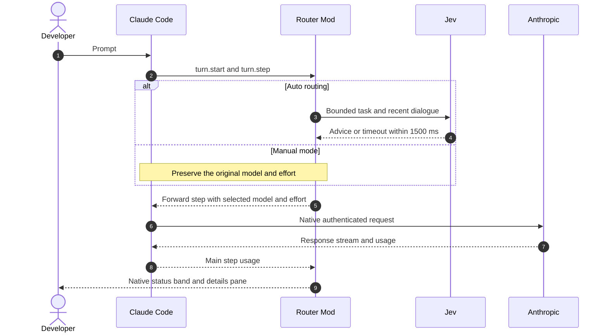

# Architecture

The native candidate routes the main Claude Code conversation through Mods. Subagents retain Claude's own model selection. Jev advises a tier; a local policy chooses the model and effort. Claude builds and sends the Anthropic request.

The released 0.8 plugin still uses the gateway. Native packaging and the Team launcher switch are pending. The gateway is retained for rollback during this transition, rather than as a dependency of the native request path.

## Request path

```mermaid
sequenceDiagram
    autonumber
    actor Dev as Developer
    participant Code as Claude Code
    participant Mod as Router Mod
    participant Jev
    participant API as Anthropic
    Dev->>Code: Prompt
    Code->>Mod: turn.start and turn.step
    alt Auto routing
        Mod->>Jev: Bounded task and recent dialogue
        Jev-->>Mod: Advice or timeout within 1500 ms
    else Manual mode
        Note over Code,Mod: Preserve the original model and effort
    end
    Mod-->>Code: Forward step with selected model and effort
    Code->>API: Native authenticated request
    API-->>Code: Response stream and usage
    Code-->>Mod: Main step usage
    Mod-->>Dev: Native status band and details pane
```

The Mod edits only `turn.step.model` and `effort`. It forwards chunks through `yield* next(request)` and returns the engine's result. It does not implement an Anthropic client, carry Anthropic credentials, or proxy the response.

Claude owns request construction, thinking signatures, tools, output limits, beta headers and the native cost ledger. Direct probes accepted Sonnet/Opus histories over 589K tokens, signed-thinking/tool history across Sonnet → Opus → Haiku, and deferred MCP tools on rewritten Haiku with a 128000-token output-limit setting.

## Responsibilities

| Component                                     | Owns                                                                             |
| --------------------------------------------- | -------------------------------------------------------------------------------- |
| [Native hooks](../hooks/native-router.mjs)    | Turn identity, commands, lifecycle, per-step rewriting and response observation. |
| [Jev contract](../lib/jev-contract.mjs)       | Bounded task payload, answer validation and retry rules.                         |
| [Native Jev](../lib/native-jev.mjs)           | Native HTTP, total deadline, one unfinished request and circuit breaker.         |
| [Router controller](../lib/native-router.mjs) | Context fit, exact model identity, history epochs and one-turn pin behavior.     |
| [Policy](../lib/policy.mjs)                   | Quality tiers, vote hysteresis, failure escalation and switching gates.          |
| [Native costs](../lib/native-cost.mjs)        | Cache uncertainty scenarios and conservative switching estimates.                |
| [Panel](../lib/native-panel.mjs)              | Model/reason, context/cache bars, native usage, controls and validated tuning.   |
| Claude Code                                   | Transcript, tools, Anthropic transport, credentials and billed API usage.        |

No separate daemon or routing port is required. Node is a development/test tool, not a runtime helper for routing.

## Decisions and context

A logical turn receives one Jev classification. Its tool continuations reuse that choice and add no votes. Context fit is rechecked before every step, so a large tool result can require a larger model without another classification.

Switching into a smaller context window requires both a main-response measurement from the current history epoch and Claude's local summary estimate. Use the maximum of observed input plus output and the estimate. The fit rule leaves a 20% reserve. Missing measurements retain the incumbent. There is no characters-to-tokens fallback.

An explicit context-window stop latches that model unavailable until a history reset. Failed requests suspend rewriting for the remaining turn. Native engine fallback requests pass through. The Mod never repeats an Anthropic request itself.

## State and controls

`$.state` holds session-scoped decisions, cache observations and the reactive view. A version-checked write prevents an old response or classification from overwriting a newer history. A private view mirror merges writes because reads within one dispatch are frozen.

Clear, resume, branch and rewind invalidate cache evidence. Committed compaction clears the main history's evidence. Skipped/precomputed compaction does not. Hot reload retains valid state. Subagent steps bypass routing and never replace main metrics.

Manual mode preserves Claude's model and effort. `/model` and `/router off` enter Manual. Only `/router auto` enables routing. A one-turn pin serves the next turn and its continuations, then resumes the prior automatic incumbent. Pins cannot enable Auto or bypass readiness/context guards.

A process environment value retains control mode across in-process history changes. `$.store` keeps only the conversation's mode preference for a fresh process. It holds no transcript, cross-session warmth or separate cost ledger. Pins and draft tuning remain ephemeral.

See [controls and tuning](native-router.md). The Jev key is a sensitive plugin option. Advanced settings live in the active profile's `router.json`.

## Native HTTP limits

The advice budget is 1500 ms including a possible transient retry. A timeout does not retry. Retry-After is honored only within the remaining budget. Three launched failures pause Jev for 60 seconds. Busy skips do not count as failures.

The pinned host has no per-request abort option for `$.http.fetch`. A timed-out request retains the admission slot until it settles. The host's observed wire timeout is about 30 seconds. Reload/unload cancels host work. A policy refusal degrades routing and is never bypassed with a subprocess.

The twenty-process native test sample measured p95 fallback at 1504 ms and worst case at 1505 ms. A twenty-call burst produced one timeout, nineteen busy skips and one wire request. See [recorded acceptance results](../experiments/mod-router/results/native-http-acceptance.json) for scope and remaining lifecycle cases.

## Cache and money

Cache keys use the exact response model and requested effective effort when the response matches that request. The known Haiku snapshot has an explicit mapping. Unknown substitutions do not receive credit for a requested model.

Cached prefix is `cache_read + cache_creation`. Output belongs to next-context sizing, not the already-cached prefix. Freshness is a five-minute estimate with a 30-second margin. Native usage does not identify a one-hour TTL.

Policy compares the candidate's worst supported cache-write scenario with the incumbent's best input scenario. The panel shows configured-price ranges and projected payback. It does not claim achieved savings. Claude's native `/cost` ledger owns total API cost. Jev spend is not included.

## Deployment and transition

The target setup is one native plugin, one secure Jev key and normal native model selection. Remove the gateway URL, alias picker and hint headers from Team's launch. Disable its legacy router hook. Keep the old 0.8 installation separately available for rollback until the canary passes.

Team's plugin directory currently shares the personal cache. The canary must use a Team-owned local Mod path, so updating it does not replace the personal gateway installation.

For the approved main-only scope, no verified feature requires the proxy. Remaining cutover work is lifecycle/resource validation, fresh/resumed sessions, native fallback/remaining request controls, trace evaluation, canary/rollback, root packaging and documentation cleanup. These gates validate the switch rather than justify a permanent proxy.
