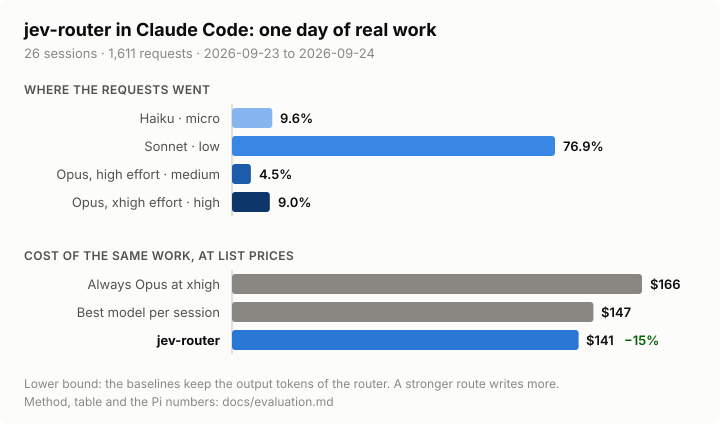

# Evaluation

The native Mod has no measured savings result. The pane reports Claude's own usage and configured-price scenarios. Its one counterfactual is [routing vs your model](#routing-vs-your-model), an estimate at configured list prices, not a bill or a measured saving.

This page separates an older gateway experiment from a shadow replay of native policy. Neither result measures answer quality or proves lower real spend. [Activity routing](#activity-routing) adds two checks of the activity label, with no savings result either.

## Historical gateway experiment

These figures are retained from the earlier gateway implementation. They do not evaluate the native Mod or its current routes. The snapshot covers 26 Claude Code sessions and 1,611 requests from 2026-09-23 09:05 UTC through 2026-09-24 06:00 UTC. Jev advised on 111 prompts.



The original list-price comparison was:

| Scenario                                        | Estimated cost | Difference from router |
| ----------------------------------------------- | -------------: | ---------------------: |
| Always Opus at `xhigh`                          |        $166.26 | Router was 15.5% lower |
| Strongest model selected for each whole session |        $146.54 |  Router was 4.1% lower |
| Earlier gateway router                          |        $140.55 |                      — |

The session-level baseline assumes a user knows the strongest tier needed by each session and uses it for every request. All scenarios reuse the router's token and output counts. The estimate holds stronger-model output constant, so it does not capture any change in output length. The [original evaluation method](#historical-method-and-limits) lists the limits.

This is one developer's short trace at configured list prices. It does not include a quality review. Do not use these values as expected results for the native Mod.

## Native shadow replay

The native replay uses an aggregate Team-session trace from 2026-09-23 through 2026-10-04. The checked-in result is [`trace-evaluation.json`](../experiments/mod-router/results/trace-evaluation.json), produced by [`trace-eval.mjs`](../experiments/mod-router/scripts/trace-eval.mjs).

| Coverage item                                               |                            Result |
| ----------------------------------------------------------- | --------------------------------: |
| Team rows                                                   |        24,408 across 112 sessions |
| Main-conversation decision rows                             |                            11,619 |
| Main decisions with Jev advice                              |                                37 |
| Advised decisions replayed at both cache-prefix bounds      |                          37 of 37 |
| Decisions with a different route or reason between policies |                           0 of 37 |
| Differing switches and estimated switch cost                | 0; no switch cost can be computed |

The legacy replay matched the logged tier and reason for 1,704 of 1,704 replayable decisions. On the 37 advised main decisions, both policies produced the same route and reason. This replay therefore shows no native routing difference and cannot support a savings claim.

Eight advised decisions reached a switching-cost threshold calculation. The native configured-price tax ranged from $0.028660 to $3.471293 and the threshold from 0.860483 to 0.953675. These are shadow estimates for individual next requests, not bills or additive savings.

The old log records cache reads but not uncached input or cache-creation tokens. The native replay tests two prefix bounds: cache reads alone and the full observed input. All 37 decisions matched at both bounds. That is a bound-stability check, not an exact reconstruction of native cache state.

### Reproduce the native replay

Run this command with the Team `decisions.jsonl` log available in its usual Claude Code profile:

```sh
node experiments/mod-router/scripts/trace-eval.mjs
node --test experiments/mod-router/scripts/trace-eval.test.mjs
```

The script writes aggregate counts, reason histograms, route transitions, and shadow estimates. It excludes prompts, session identifiers, agent names, error text, headers, keys, and filesystem paths from the result. It reads the local profile log and writes the JSON result file.

## Activity routing

Activity routing has no measured result. The replay above predates it and covers tiers only. It is `on` by default since 1.7, with defaults chosen from Anthropic's published benchmarks and a list-price replay of one developer's sessions; [Activity routing](activity-routing.md#what-the-estimates-mean) gives that replay and its limits. The pane counts turns, requests, switches, and the turns `on` would route differently, with a configured list-price estimate of those turns' next requests, not a measured saving. Two checks look at the classifier's activity label.

The figures plan §11 tracks (tool agreement of at least 80% on `code` against `ops` and `explore`, Jev p95 latency of at most 450 ms, at most 1 tool-error escalation in 10 cheaper activity moves, a negative would-route estimate in `shadow`, the number of activity switches) are read from the Usage tab's **ACROSS SESSIONS** block, which shows the counts kept since the last reset: **Code/ops/explore** for the tool agreement on turns the classifier answered `code`, `ops` or `explore`, **Agreement** and **Mismatch** for all of them, **Activity moves** for moves inside a tier taken and refused (a refusal by a hold or the credits cap included), **Escalations** for the tool-error escalations that followed a cheaper activity move in `on` while the turns stayed on its route in `on` (a turn in `shadow` or `off` ends the watch, a pin in between does not, and an escalation the credits cap held counts), **Latency** for the active classifier's p95 wait, **Shadow** for the would-route count and estimate. Latency is kept in fixed buckets, so the p95 reads as a bound (`≤ 350 ms`); it is the wait for the classifier's answer, transient retries included, without the routing after it, so it compares with the probe's p95 below, and is not recorded with activity routing `off`. `/router` without a UI surface prints both agreements. The underlying counts are the `activity:stats:v1` and `activity:metrics:v1` stores described in [Architecture](architecture.md).

### Tool agreement

Each finished turn is labelled from the tools the assistant used, locally and at no cost. Only the bucket and counts are kept; no text or path is stored.

| Observed bucket | Rule, first match                                                                                                                           |
| --------------- | ------------------------------------------------------------------------------------------------------------------------------------------- |
| `code`          | An edit tool (`Edit`, `Write`, `MultiEdit`, `NotebookEdit`) on a path that is not a doc path                                                |
| `docs`          | Edits only to paths ending `.md`, `.mdx`, `.rst`, or `.txt`, or under a `docs/` directory                                                   |
| `ops`           | A Bash command that is not read-only                                                                                                        |
| `read`          | Other tool use: reads, searches, web fetches, Task, TodoWrite, MCP tools, and Bash commands that only read, such as `ls`, `grep`, `cat`, or `git status` and `git diff` |
| `talk`          | No tool calls                                                                                                                               |

A subagent's edits and commands never reach the main transcript, so a turn that delegates its coding to a Task reads as `read`: agreement on `code` is understated for delegated work. A Bash command counts as read-only only when every command in the pipeline or list is on a short list of readers. Redirects, command substitution, and `find` with `-exec` or `-delete` are not read-only, and neither is any command the list does not name.

The classifier's activity agrees with the turn when the bucket is one it allows:

| Activity  | Allowed buckets        |
| --------- | ---------------------- |
| `code`    | `code`                 |
| `debug`   | `code`, `ops`, `read`  |
| `explore` | `read`, `talk`         |
| `plan`    | `talk`, `read`, `docs` |
| `review`  | `read`, `talk`         |
| `ops`     | `ops`, `read`          |
| `docs`    | `docs`                 |

Agreement is a weak check. It tells `code` from `ops` and `explore` well, but not `ops` from `explore` when the commands only read. It cannot tell `plan` from `review`, and it says nothing about whether the route was good enough. It does catch the costly mistake, a cheap route on a coding turn. The Usage tab shows the session's count as `Agreement`, over the turns where the classifier gave an activity at or above `activityMass`, in `on` too when the route kept another activity. The counts kept across sessions hold the classifier's raw answer, `uncertain` and no answer included, against the bucket. The pane's **ACROSS SESSIONS** block counts agreement over the answers that name an activity; `uncertain` and no answer appear only in **Labelled**.

### Activity probe set

`test/fixtures/activity-probe.json` holds 70 synthetic prompts, ten for each activity, weighted to the boundary cases: "fix the deploy script" against "deploy the fix", "why does the test fail" against "make the test pass", short replies after a dialogue, and a review followed by a fix. It holds no real user text.

```sh
node scripts/probe-activity.mjs [classifier]
```

The script sends each prompt to one classifier as the router would ask it, with activity routing forced to `shadow`. It reads credentials as `probe-classifier.mjs` does and needs a classifier you can reach. The run is billed on a paid classifier, and it is run by hand, not in CI. It writes accuracy, an expected-by-answered confusion matrix, p50 and p95 latency against the classifier's deadline, and error counts to `experiments/mod-router/results/activity-probe-<classifier>.json`. For Ollama the latency covers both requests. It never prints a key.

Five probe results are checked in, run on 2026-10-09 and 2026-10-10 (UTC) with the synthetic set above: Jev against the live typesafe.ai API, OpenAI against the live Decisions API, Clef and Clef Flash against the live Cloudflare API, Ollama with `qwen3.5:9b` on an Apple M2 Pro laptop:

| Classifier |  Correct | p50 latency | p95 latency | Result file                                                                                          |
| ---------- | -------: | ----------: | ----------: | ---------------------------------------------------------------------------------------------------- |
| Jev        | 70 of 70 |      260 ms |      299 ms | [`activity-probe-jev.json`](../experiments/mod-router/results/activity-probe-jev.json)               |
| OpenAI     | 70 of 70 |      161 ms |      286 ms | [`activity-probe-openai.json`](../experiments/mod-router/results/activity-probe-openai.json)         |
| Clef       | 69 of 70 |      444 ms |      883 ms | [`activity-probe-clef.json`](../experiments/mod-router/results/activity-probe-clef.json)             |
| Clef Flash | 69 of 70 |      470 ms |      874 ms | [`activity-probe-clef-flash.json`](../experiments/mod-router/results/activity-probe-clef-flash.json) |
| Ollama     | 66 of 70 |     2986 ms |     3483 ms | [`activity-probe-ollama.json`](../experiments/mod-router/results/activity-probe-ollama.json)         |

Ollama's latency covers both requests and stays inside its 5000 ms deadline; on slower hardware the activity step is skipped when less than 300 ms remain. They measure the label on synthetic prompts, not routing quality or savings. The activity question costs little time: 30 alternating pairs of the same prompts, with and without it, gave Jev p50 259 ms both ways and p95 300 ms without, 306 ms with; OpenAI p50 163 ms and 162 ms, p95 296 ms and 349 ms. OpenAI's first request of a run took about 2.3 s of its 3000 ms deadline. The Classifier tab shows each result under its classifier, such as `activity probe 70/70 · p95 299 ms · Oct 10` (UTC date), when the classifier runs the probed model. The script regenerates `lib/probe-results.mjs` from the result files after each run; `npm run probe:results` does it alone, and a test fails when the two disagree. A run with no answer or no p95 latency, such as one with a revoked key, exits with an error and writes neither file. `policy.activityMass` was not tuned on any classifier; run the probe before you trust it with a new one.

## Routing vs your model

The Usage tab compares what routed replies cost with what the same tokens would cost on your model, the session's model and effort before routing. It answers "at list prices, did routing spend more or less than my own model for this work". It does not answer whether the answers were as good.

Method, per main reply that routing chose:

- **Routed** prices the usage Claude reported (uncached input, cache read, cache write, output) on the model that served it.
- **Yours** prices the same tokens on your model. While this reply and the one before it ran on your route, it is the reply's own usage, so a session on your model differs by exactly $0.00. Otherwise your model keeps one cache that never switched: it reads the previous prompt, up to this one less its uncached input, inside the cache lifetime, unless a compaction shrank the history or your model or effort changed since, and never less than the API actually read; it writes the rest. Output tokens are the same.
- **Parts**: the served model on your cache against yours is the model price, under cheaper models when negative and stronger than yours when positive; routed against the served model on your cache is the cache the switches cost, never negative. They sum to the difference. The pane rounds to cents and gives the remainder only to a part that is not zero: a surplus to the switch part, else the stronger part, else the cheaper part toward $0.00; a shortfall comes off the stronger part, down to $0.00, then the cheaper part. The shown parts add up, none changes sign, and none appears from rounding alone.
- **Prices**: `router.json` list prices through `ratesAt`, so Haiku 5.5 above 100,000 prompt tokens is priced at 5x. Claude Code reports no 5m/1h split to a Mod, so cache writes use the lifetime Claude Code 2.1.296 gives the main conversation by its own rule: one hour on a Claude plan unless an environment variable or the `promptCacheTtl` setting says otherwise, five minutes with an API key.

Checks:

- Unit tests (`test/savings.test.mjs`) cover a session that saves, one that costs more with Haiku as your model, equal routes at exactly 0, cache expiry at 5m and 1h, a compaction, a change of your model or effort, the 100K surcharge, an unpriced model, and a corrupted store. `test/hook-routing.test.mjs` covers two sessions finishing turns at the same moment.
- A one-off replay, not checked in, of this machine's main-conversation transcripts from 2026-10-01 to 2026-10-10 (nine sessions with 10 or more replies) gave $0.00 for every session that ran only on the model it was compared with: three on Opus 5.5, one on Haiku 5.5. Every main-conversation cache write in them was a one-hour write, which is what the lifetime rule gives on this Max plan.
- A live Claude Code 2.1.296 session on 2026-10-10, Opus 5.5 at `high` with turns pinned to Haiku 5.5, showed **Routed replies $0.48** beside **Cost $0.480 reported by Claude** for the same 16 replies; its last Haiku reply had a 114K-token prompt, which agrees only at the 5x rate. A Haiku 5.5 session with a pinned Opus turn showed $0.45 routed against $0.446 reported.

Limits:

- Output length is held the same. A stronger model may write less, or finish in fewer tool steps; a cheaper one may need more. The readout cannot see either.
- Answer quality is not measured. A saving bought with worse answers would read the same.
- Your model's cache is simulated, and a five-minute session that the lifetime rule takes for one hour (a plan subscriber billed as overage) would read too much cache on your side.
- A route that changes only the effort costs the same per token; it shows only its cache writes.
- Subagents, classifier charges and replies with routing off are not counted. On a Claude plan the dollars stand for quota, not cash.
- The saved column keeps one record per session, so sessions finishing turns at the same moment both count. Claude Code's store has no atomic update, which leaves these gaps: the same session open in two Claude Code processes at once can lose one's turn; a turn finishing in another process during **Reset stats** can be lost; a session's total from before a reset comes back if its first saved reply has the same millisecond as the reset, or if the system clock moved back across the reset; and the activity counts across sessions are still one shared record, where two sessions finishing turns at the same moment can lose one turn's counts. The router reads every session's record at session start and when the pane opens, so that read grows with the number of sessions since the last reset.

## Historical method and limits

- Costs use configured USD list prices per million tokens. They are not subscription cash charges.
- The older gateway baseline uses the router's observed tokens and cache reads. After a route change, the baseline assumes the prior context can be read from cache.
- The native replay uses the current default routes and prices, with recorded model IDs substituted. It compares the native cost bounds with a legacy cost model using the same policy state and trace facts.
- The replay cannot reconstruct exact native cache prefixes or one-hour cache evidence from the old log. The native cache model treats TTL as unknown.
- The replay applies the legacy state chain to both policy arms. It does not simulate later state changes after a different decision.
- Failure signatures and pins are not present in the trace. The relevant route decisions are excluded from comparison.
- Most main rows are tool continuations or have no Jev advice. Only 37 advised decisions support the native comparison.
- Costs cover the next request. They use the last observed output size and do not model effort-dependent output length or future answer quality.
