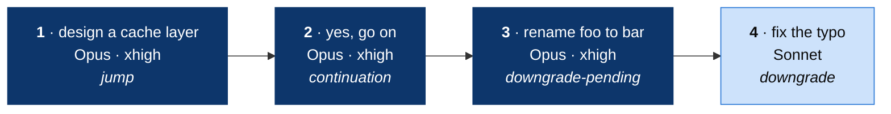

# User guide

After the [install](../README.md#install), work in Claude Code as usual. The
router selects the model and the effort for each turn. This guide shows how
to read what it does, and how to control it.

- [Check the setup](#check-the-setup)
- [A session, step by step](#a-session-step-by-step)
- [Read the status line](#read-the-status-line)
- [Read `/router:status`](#read-routerstatus)
- [Pin a tier](#pin-a-tier)
- [Read the decision log](#read-the-decision-log)
- [Update](#update)
- [Stop using the router](#stop-using-the-router)
- [Troubleshooting](#troubleshooting)

## Check the setup

1. Start Claude Code. `/model` shows `Jev Router (auto)` as the model.
2. Send a prompt. If setup added the status line, it shows the route, for
   example `jev-router ▸ sonnet-5 · high · same-tier`.
3. Run `/router:status`. It shows `Jev routing: active.`

If a step fails, read [Troubleshooting](#troubleshooting).

## A session, step by step

An example of four turns. Each box is one prompt with its route and reason.



1. A confident vote for hard work goes up two tiers at once.
2. A prompt that continues the task keeps the route.
3. One vote for a lower tier is not enough. The route stays.
4. The second vote in a row moves the route down.

The tool calls in a turn keep the route of the turn, so the cache stays warm.
The [README](../README.md#how-jev-selects-a-tier) gives all the rules.

## Read the status line

```text
jev-router ▸ opus-5-5 · xhigh · upgrade
             │          │       └─ reason for the route
             │          └─ effort
             └─ model of the last turn
```

| Line                                             | Meaning                                             |
| ------------------------------------------------ | --------------------------------------------------- |
| `jev-router ▸ …`                                 | The route of the last turn in this session.         |
| `jev-router: no turn yet`                        | This session has no routed turn.                    |
| `router: gateway off, the next prompt starts it` | The gateway stopped after idle time, or it crashed. |

The line changes after each message.

**The route changed:**

| Reason        | Meaning                                                                      |
| ------------- | ---------------------------------------------------------------------------- |
| `upgrade`     | Two votes in a row for a higher tier, with enough confidence.                |
| `jump`        | One vote confident enough to go up two tiers.                                |
| `downgrade`   | Two votes in a row for a lower tier, with enough confidence.                 |
| `escalation`  | The same error came back after an edit. The route went up one tier.          |
| `context-fit` | The selected model cannot hold the context. A larger window serves the turn. |
| `cash-gate`   | The cold-write guard stopped a switch to a `credits` model.                  |

**The route stayed:**

| Reason              | Meaning                                                             |
| ------------------- | ------------------------------------------------------------------- |
| `same-tier`         | Jev agreed with the current tier.                                   |
| `continuation`      | The prompt continues the task.                                      |
| `upgrade-pending`   | One vote for a higher tier. The next vote decides.                  |
| `downgrade-pending` | One vote for a lower tier. The next vote decides.                   |
| `hold`              | The route stays up for two turns after an escalation.               |
| `uncertain`         | Jev did not select a tier.                                          |
| `no-advice`         | No Jev answer: no key, an error, a pause, or a prompt without text. |

`forced` means that the gateway was started with `--force-tier`.

## Read `/router:status`

`/router:status` shows the gateway, the routes and the last turn. For a
vote, it also shows the numbers:

```text
Router v0.7.0, gateway: http://127.0.0.1:43170, alias `jev-router`.
Jev routing: active.
Default tier: low.
…
Last turn: low → claude-sonnet-5 at high, reason upgrade-pending, context 84210 tokens, cache reads 83904.
Why: Jev asked for a higher tier; the route stays until the votes and the mass are enough.
Estimate: upgrade mass 0.78 against a bar of 0.84, switching tax $0.66 at list prices, 1 vote(s) in a row, cache: candidate unknown, current warm.
```

- **Upgrade mass** is the Jev confidence in a higher tier. It must reach the
  bar.
- **The bar** grows with the switching tax: the cost to write the context
  into a cold cache. Here Opus has no warm cache.
- **Cache** is `warm`, `expired` or `unknown`. `unknown` means no response
  for that cache since the session started or the conversation got shorter.
- **Dollars** are list prices. On a subscription plan, they show the relative
  cost only.

## Pin a tier

To run one turn on a fixed tier, type the tier skill before the prompt:

```text
/router:high  redesign the auth flow
/router:micro rename foo to bar in this file
```

The status line shows the reason `pinned`. Tool calls in that turn stay on the
tier; the next prompt goes back to Jev.

`/model <name>` also works, but it stops the routing for the rest of the
session.

## Read the decision log

The gateway writes one JSON line for each routed request to
`~/.claude/plugins/data/router-alexei-led-claude-router/decisions.jsonl`. The
log has no prompt text.

| Field          | Content                                                                            |
| -------------- | ---------------------------------------------------------------------------------- |
| `tier`         | The tier of the request.                                                           |
| `model`, `effort` | The model id and the effort that the gateway sent. `effort` is `null` for a model without effort. |
| `reason`       | The rule that decided. Tool calls show `tool-continuation`. `error`: routing failed and the default tier served. |
| `advice`       | The Jev probabilities for each tier, and for "continues the task".                 |
| `estimate`     | The numbers of a vote: confidence, bar, switching tax, cache state.                |
| `shadow`       | The cost of the Jev choice against the current route. The downgrade tax uses the same arithmetic. |
| `observed`     | The usage of the response: model, effort, context tokens, cache reads, output.     |
| `failed`       | Anthropic answered a routed turn with an error: status, tier, model, effort.       |
| `historyBreak` | A compaction or a rewind. The votes and the cache estimates reset.                 |
| `cacheReset`   | The context shrank by more than 20%. The cache estimates reset.                    |

Two useful queries:

```sh
LOG=~/.claude/plugins/data/router-alexei-led-claude-router/decisions.jsonl
jq -r 'select(.observed) | .observed.model' $LOG | sort | uniq -c    # requests by model
jq -r 'select(.reason) | .reason' $LOG | sort | uniq -c | sort -rn   # decisions by reason
jq -c 'select(.failed) | .failed' $LOG                              # failed turns
```

`scripts/transcript-models.sh <transcript.jsonl>` shows the model of each
assistant message in a Claude Code transcript.

## Update

1. Update the marketplace and the plugin:

   ```sh
   claude plugin marketplace update alexei-led-claude-router
   claude plugin update router@alexei-led-claude-router
   ```

2. Restart Claude Code. The next prompt replaces the running gateway.
3. Run `/router:setup` once. The status line command contains the plugin
   version.

## Stop using the router

1. In `~/.claude/settings.json`, remove `model`, `env.ANTHROPIC_BASE_URL`,
   `env.ENABLE_TOOL_SEARCH`, `env.CLAUDE_CODE_GATEWAY_HINT_HEADERS` and the
   `jev-router[1m]` row of `modelPicker.options`.
2. If setup changed your status line, restore the old command.
3. Restart Claude Code.
4. To remove the plugin, run
   `claude plugin uninstall router@alexei-led-claude-router`.

The gateway stops by itself after two hours without requests.

## Troubleshooting

| Symptom                                                           | Cause                                         | Fix                                                                                  |
| ----------------------------------------------------------------- | --------------------------------------------- | ------------------------------------------------------------------------------------ |
| "There's an issue with the selected model (jev-router[1m])"       | The session started before the restart.       | Restart Claude Code.                                                                 |
| Claude Code rejects `jev-router`                                  | The session does not use the gateway.         | Run `/router:setup`, then restart Claude Code.                                       |
| The status line shows `gateway off` after the next prompt         | The gateway cannot start, for example because `router.json` has an unknown key. | Run `/router:status` to see the error. Read `gateway.log` next to `decisions.jsonl`. |
| Every turn has the reason `no-advice`                             | No Jev key, or Jev fails.                     | Run `/router:status`. Read the `router:` lines in `gateway.log`.                     |
| The effort is not the effort that you set                         | The model does not accept that effort.        | The gateway uses the nearest lower level. Haiku has no effort and no thinking.       |
| 429 or 529 errors                                                 | Anthropic rate limits or overload.            | Claude Code waits and tries again. The gateway sends these errors through unchanged. |
| A `router.json` change has no effect                              | The gateway reads the configuration at start. | Run `pkill -f scripts/gateway.mjs`. The next prompt starts a new gateway.            |

To see if the gateway runs, open `http://127.0.0.1:43170/v1/models`. The list
shows the alias.
