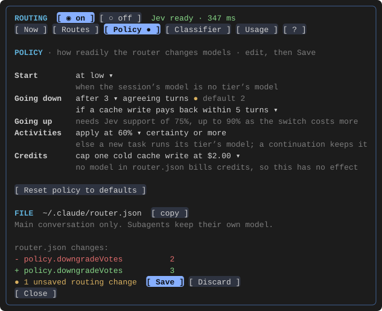

# User guide

## Start a session

Install the plugin from its marketplace, or load a checkout with `--plugin-dir /path/to/claude-router`:

```sh
claude plugin marketplace add alexei-led/claude-router
claude plugin install router@alexei-led-claude-router
```

Start with the full baseline model so routing has a known starting point:

```sh
claude --model claude-haiku-5-5
```

In Claude Code:

1. Run `/plugin configure router`.
2. Enter the credentials of the classifier you use, and save them:
   - **Jev** (the default): the Jev API key from typesafe.ai.
   - **Clef** or **Clef Flash** on Cloudflare Workers AI: the Cloudflare API token and the Cloudflare account ID. One token covers both models.
   - **OpenAI**: an OpenAI API key. The prompt text goes to OpenAI.
   - **Ollama**: no credential. Run `ollama serve` and pull the model; the prompt text stays on this machine.
3. To use another classifier, open the pane's **Classifier** tab and select its row. See [Choose the classifier](#choose-the-classifier).
4. Check the band above the prompt: `Routing on · ready`. On a model that no tier routes to, and that no activity override uses with activity routing `on`, the session starts with routing off and the band says why; run `/router auto` to route.

Keys are stored as sensitive plugin options. Do not paste them into a model conversation. The [configuration guide](configuration.md) covers optional settings and migrations.

## Read the status band

Router draws one line above the prompt. The line ends with a **Router** button that opens the pane. When the band is narrow, the less important parts drop first: classifier figures, then context and cache, then the activity, then the reason. The tier and model always stay, except behind a classifier warning: the warning and its **Set up** button come first, and the route gives way to them.


Read the first line of the picture from left to right:

- **Tier meter** `▂▄▆█`: one bar per tier, lit up to the current tier in its color, like signal strength.
- **Tier, activity, and model**: the route for this turn. The activity sits between the tier and the model as a verb in orange italic, such as `coding →`: `coding`, `debugging`, `exploring`, `planning`, `reviewing`, `running` (commands: git, builds, tests, CI) or `documenting`. See [Route by activity](#route-by-activity). **fallback** means Claude Code answered with another model.
- **Reason**: one or two words with a direction, such as `↑ jump`, `↓ downgrade`, `= fits`, or `… waiting to go down`. An activity move reads `↗ coding` or `↘ running`, and a refused one `… running: not worth a switch`.
- **Classifier support**: what the active classifier, such as Jev or Clef Flash, gave the switch against the bar the policy required, such as `Jev 88% ≥ 82%`. When whole percents would read as equal, it shows tenths: `Jev 81.0% < 81.4%`.
- **Switch cost**: `switch cost ≈ $0.37`, the policy's price for the switch it weighed this turn, mostly the prompt cache the other model must write. For a move to a cheaper model it is net of what that model saves over the next turns. The higher the cost, the higher the bar a stronger model must clear.
- **ctx** and **cache hit**: context use and the share of input read from the cache on the last reply. They turn yellow at 60% context and red at 80%.

| Band shows                                      | Meaning                                                                                                               |
| ----------------------------------------------- | --------------------------------------------------------------------------------------------------------------------- |
| `Routing on · ready`                            | Routing is on and ready for a new turn.                                                                               |
| `choosing for this turn…`                       | The classifier and local policy are running. The spinner says `Choosing model`.                                       |
| `⏵ next turn: high ✕`                           | A pin is set. **✕** cancels it.                                                                                       |
| `⚠ Jev: no API key · keeping model`             | The active classifier lacks a setting. **Set up** opens the secure plugin dialog.                                     |
| `⚠ Clef: no account ID · keeping model`         | Clef has its API token but no Cloudflare account ID. **Set up** opens the dialog.                                     |
| `⚠ Jev timed out · keeping model`               | The classifier failed: timed out, unreachable, rejected the key, or paused.                                           |
| `○ Routing off [ Turn on ] · every turn uses …` | Routing is off: Claude's model answers every turn. **Turn on** turns it back on. The footer also shows `routing off`. |
| `✕ Routing unavailable`                         | Nothing routes: an old Claude Code or leftover v0.8 settings. **Fix** opens the pane.                                 |
| `○ Router · subagents keep their own model`     | You are viewing a subagent's transcript, which Router does not route.                                                 |

The band shows one routing control at a time. While routing is on, hover over the band for a second row: pin a tier for the next turn, **Turn off** routing, or show two rows. While routing is off, **Turn on** sits on the first line next to `Routing off` and stays at any width: a narrow band drops the explanation and the model first. On a narrow band the hover row drops `routing on`, then **2 rows**, then `pin next turn`, then the pins; it keeps **Turn off**, and **1 row** when the band shows two. The hover row needs a pointer: from the keyboard, run `/router off`, or open the pane and press `f`. The two-row band adds this session against your model, the one `/model` selects now: `session  saved $1.84 (22%) vs Opus 5.5 · xhigh  ·  64 replies  ·  cold-cache writes +$0.47`, or `session  extra $2.48 (×5.0) vs Haiku 5.5 · high  ·  41 replies  ·  stronger models +$2.31` when routing cost more. The last part names the larger of the two costs behind the result, when there is one. After a `/model` change the row shows the whole session against the new model. Before the tenth routed reply it reads `session  3 replies · too early to compare`. When the row is short, the cost part drops first, then the reply count. Router remembers that choice across sessions. When Router changes the model between turns, a toast reads `Model changed: old → new · reason`. A pin does not raise one, and neither does a change of effort alone.

The band steps aside while a survey needs the space.

Tool continuations do not trigger another classification. Subagent choices remain unchanged.

## Open the router pane

Run `/router` or select **Router** above the prompt. Without a UI surface, as in `claude -p`, `/router` prints a short status instead. The pane has five tabs. Select a tab or press its digit while the pane has focus.

| Tab          | What it answers                                                                                                                                                  |
| ------------ | ---------------------------------------------------------------------------------------------------------------------------------------------------------------- |
| 1 Now        | What runs next turn, and why: tier, model, activity, the reason with the support it weighed; classifier support per tier with **pin**; the last 30 replies.     |
| 2 Routes     | Which model runs: one grid of tiers by activities, the activity routing mode, and an editor for the selected cell.                                               |
| 3 Policy     | How readily the router changes models: the start tier, going down, going up, the activity threshold, the credits cap; the `router.json` path.                    |
| 4 Classifier | Which classifier to ask: one row per classifier to compare, the active one's deadline, wait, health and credentials, and the counts kept across sessions.        |
| 5 Usage      | What routing cost: routing vs your model, plan quota, this session by activity, and Claude's readings with the estimates behind **details**.                     |

The top line of every tab, `ROUTING [ ◉ on ] [ ○ off ]  Jev ready · 347 ms`, shows the routing mode, switches it, and says whether the classifier is ready. Press `o` or `f` while the pane has focus. **?** shows what the estimates leave out. When routing is unavailable, the top line reads `ROUTING  unavailable  Claude’s model is kept` with the reason under it, and offers no on or off: see [Troubleshooting](#troubleshooting).


The **Now** tab answers "what runs next turn, and why". **Next turn** names the tier, the model and effort, and, when an activity override runs, the tier's own model beside it. **Activity** names the classifier's activity as a verb, such as `coding 84%`, with the two next answers and the threshold at which an activity applies. **Why** gives the reason; under it, `Jev gave stronger tiers 88% (needs 82%) · switch ≈ $0.48` compares the classifier's support for the switch with the bar the policy set, and gives the estimated switch cost. The ladder lists the tiers from strongest to cheapest with the route each one uses and the support the classifier gave it on the last turn. **pin** forces that tier for the next turn only. In `shadow`, a **Shadow** line says what `on` would run; see [Route by activity](#route-by-activity).

### Save and undo changes

The settings tabs follow one of two rules, and the section captions say which:

- **Routes** and **Policy**: one draft for both, edited as a set, then saved. Changes stay a draft until **Save** (`s`). **Discard** (`d`) drops them. The draft stays when you change tab or close the pane: the tab whose settings changed reads **Routes ●** or **Policy ●**. Those two tabs list the `router.json` lines that **Save** will write; the other tabs show the count with **Save** and **Discard**. A new session drops the draft.
- **Classifier**: a row or a deadline is written to `router.json` when you select it.

Every write applies from the next turn and can be undone. **Undo** (`u`) puts back the settings the last write changed, from any tab, and leaves any other edit to `router.json` alone. A new session clears it. Green notices confirm a write or an undo; a red one names why nothing was written.

### Compare routing with your model


The Usage tab opens with the answer, such as `Routing saved $1.84 (22%) this session vs Opus 5.5 · xhigh`, or `Routing cost $2.48 (×5.0) more this session than Haiku 5.5 · high`, once the session has 10 routed replies. **ROUTING VS YOUR MODEL** follows with the figures behind it. Your model is the model `/model` (or `--model`) selects now, at the session effort, shown in the heading. For every reply routing chose, it prices the reported tokens on the model that served them. It also prices the same tokens on each model in `router.json`, at its list prices. After a `/model` change, the session column shows the whole session against the new model. The line `vs other models: Sonnet 5.5 extra $2.28 · Haiku 5.5 extra $6.19` shows the session against the others, each from its tenth routed reply.

| Line                       | What it is                                                                                                                                  |
| -------------------------- | ------------------------------------------------------------------------------------------------------------------------------------------- |
| Routed replies             | What the routed replies cost on the models that served them.                                                                                |
| Same tokens on your model  | What the same input and output tokens cost on your model, with one cache that never switched.                                              |
| Difference                 | Routed minus yours. Green with a percentage when routing cost less; amber with `+$` when it cost more, `×N` once it is twice yours or more. |
| cheaper models             | The part from replies on models cheaper than yours.                                                                                         |
| stronger than yours        | The part from replies on stronger models, with how many replies ran on them.                                                                |
| cache writes from switches | The part from rewriting the prompt cache after model switches.                                                                              |

The three parts add up to the difference. Two bars compare the costs, the routed one colored by the tier that spent it, and a line gives the share of replies per tier. In activity-routing `shadow`, one more line estimates what `on` would change in this session. The columns are this session and every session since the last reset; the saved column compares each reply with the model `/model` selected when it ran, so it can add up several models. A column reads `too early` until it has 10 routed replies. With routing off or unavailable and no routed reply this session, the section says every reply used your model. In a narrow pane the bars go first, then the saved column.

These are estimates, not a bill. They hold the tokens and the output length the same, although another model may write more or less, and they do not measure answer quality. On a Claude plan the dollars stand for quota. Your model's cache reads the previous prompt inside the cache lifetime Claude Code uses, one hour on a Claude plan, and never less than the API actually read. A route that changes only the effort, such as Opus at `xhigh` to Opus at `medium`, costs no less per token: it shows only its cache writes. [Evaluation](evaluation.md#routing-vs-your-model) explains the method.

### Understand usage and estimates

- **Cost** comes from Claude Code's native usage API. If the account is on a plan, a configured list-price estimate is not the subscription cash charge.
- **Context** compares the larger available context reading with the routed model's configured window. The router reserves 20% of that window. Values can be unknown when Claude does not provide the needed estimate.
- **Cache** reuse is cache-read tokens divided by the last response's input counters.
- **Classifier support**, such as **Jev support**, is the probability the classifier gave each tier on the last classified turn. The line under **Why** compares the support for a switch with the bar the policy required, and shows the estimated switch cost.
- **Last replies** on the Now tab colors each of the last 30 main-conversation replies by the tier that served it. A dot marks a reply the router did not choose, such as one with routing off. The heading counts the model switches between those replies: a change of model or effort, so a move from Sonnet to Haiku inside `low` counts too, although its color stays. Under the strip, the replies per tier, `■ low 12  ■ medium 2  ■ high 6`, double as the color key, and the replies per activity follow, such as `coding 12 · exploring 4 · running 2`.
- **Input per reply**, under **details** on the Usage tab, scales the last 30 input sizes from the lowest to the highest reading. It is a scale comparison, not a forecast.
- **Cache hits saved** is a configured-price estimate for cached reads before write costs. It is not a measured saving.
- **Next-turn difference** compares the candidate with the current model under five-minute and one-hour cache-write scenarios. A negative number means the candidate is estimated to cost less for that request.
- **Payback** estimates later turns to recover an initial difference under assumed future cache reads and the last observed output size. It does not guarantee savings.

Under routing vs your model, **PLAN QUOTA** shows the five-hour and seven-day use that Claude Code reports, and **BY ACTIVITY** shows this session by activity (see [Read the activity on the pane](#read-the-activity-on-the-pane)). **CLAUDE READINGS** puts cost, context and cache on one line; **details** adds the context and cache counters, the output of the last reply, the input per reply, and the estimates below.

The router keeps no bill. Routing vs your model is an estimate at configured list prices. The pane does not include classifier charges. Claude's native `/cost` is the source for its reported API cost.

## Route by activity

A tier says how hard the work is. The activity says what kind of work it is. The classifier names it for each new turn, by what the turn produces:

| Activity  | The turn produces                                               |
| --------- | --------------------------------------------------------------- |
| `code`    | Changed code or config, including tests                         |
| `debug`   | A found cause: failing tests, stack traces, "why does X..."     |
| `explore` | An answer: explain code, find where something happens, research |
| `plan`    | A decision or plan: design, task breakdown, trade-offs          |
| `review`  | Findings about existing code: a PR, a diff, an audit            |
| `ops`     | Executed commands: git, builds, test runs, CI, deploys          |
| `docs`    | Prose for people: README, docs, comments, commit messages       |

A mixed turn such as "fix it and commit" takes the hardest part, here `code`. The router then picks the route by tier and activity. With the default overrides, a `low` coding turn runs on Sonnet 5.5 at `high`, a `low` git turn stays on Haiku 5.5 at `high`, and a `medium` git turn moves from Opus 5.5 to Haiku 5.5 at `high`. [Activity routing](activity-routing.md) explains the default matrix, why each cell is there, and how to change it.

The mode decides what happens with the label:

| Mode     | What the router does                                                                                 |
| -------- | ---------------------------------------------------------------------------------------------------- |
| `on`     | The default. Applies the activity overrides.                                                         |
| `shadow` | Shows the activity, records the stats, and works out what `on` would run. The base route still runs. |
| `off`    | Does not ask the activity: the classifier is asked for the tier only. The base routes run.           |

To turn activity routing off or back to `shadow`, run `/router activities off` or `/router activities shadow`, or set **Activity routing** at the top of the Routes tab and press **Save**. Routing itself stays on: only the activity overrides stop. Upgrading from 1.6, where `shadow` was the default, a `router.json` without `activityRouting` now runs `on`. Choosing `shadow` in 1.6 removed the key, because `shadow` was the default then: if you chose `shadow` in 1.6, run `/router activities shadow` again after upgrading.

In `shadow` you can see what `on` would do without it running. The band marks the label `(shadow)` and dims it, and the **Now** tab's **Shadow** line says `low + code would use Sonnet 5.5 · high (shadow; using Haiku 5.5 · high)`, or `same route` when both agree. In `on`, when an override runs, the **Next turn** line adds the tier's own model: `override · low runs Haiku 5.5 · high`.

How the router moves inside a tier:

- It compares routes, not labels. If the new activity resolves to the route already running, nothing switches.
- A move to a stronger route needs the classifier's support, as an upgrade between tiers does. A move to a cheaper one must pay back its cache write within the payback horizon. One vote is enough for either, because the activity is a fact about this turn.
- An activity applies only when the classifier gives it at least 60% probability (`policy.activityMass`). Below that, or on `uncertain`, a new task goes back to its base route if the move passes the same checks; a continuation of the running task keeps its activity, or moves to the classifier's activity when that route is stronger. Tool continuations inside a turn keep the turn's route. When the classifier sees a new prompt as a continuation of the task, the activity may only move to a stronger route: `explore` can become `code`, but not the other way. Ollama does not answer the continuation question, so this rule does not apply to it.
- A pinned turn uses the pin's base route and shows no activity.
- When the classifier gives no answer at all (a timeout, a failure, a pause, or a missing key), the running route stays. When it answers the tier but gives no usable activity, only the running activity stays: the tier answer still applies, so the turn can change tier and keeps its activity there. In `shadow` and `off` the base route always runs.
- A fresh session starts with routing on when the session model is a tier's route. With activity routing `on`, a model that only an activity override uses also counts: Sonnet 5.5 on the defaults. In `off` and `shadow` it does not.

The band's activity label appears only when the activity applies, so a weak or `uncertain` answer shows none. The two-row band and the **Replies** strip show the activities of recent replies.

### Read the activity on the pane

- **Now**: the **Activity** line names the classifier's choice as a verb with its share, the two next-best answers, and the threshold at which an activity applies, such as `coding 84%   debugging 8% · planning 5%   applies at 60%+`. An `uncertain` answer is shown dim: it applies no activity. In `on`, **Why** names the cell when the activity moved the route or the route is an override, such as `coding at low runs on Sonnet 5.5 · high`, or `low runs on its base route, Haiku 5.5 · high` for a move without an activity; a refused move, a hold, or a tier change keeps its reason. **Last replies** counts the replies per activity under the strip.
- **Routes**: see [Edit routes and policy](#edit-routes-and-policy). Each activity is a row of the grid, and a cell shows the model the activity runs at that tier.
- **Usage**: **BY ACTIVITY · this session** lists turns, requests, and share per activity, then `est. cost`, the list price of that activity's replies (the same per-reply estimate as Routing vs your model, but only for turns recorded with activity routing `shadow` or `on`, so the rows need not add up to its routed total; `—` when a reply had no price), and `mostly on`, the route most of its replies used, such as `Sonnet 5.5 · high`. A narrow pane drops `mostly on`, then `est. cost`. Below the table are the switches split by tier and by activity, with `· 2 refused` when activity moves were refused in `on` (not worth the cache write, a hold after an escalation, or the credits cap), and **Agreement**, how often the tools a turn used fit the classifier's activity (see [Evaluation](evaluation.md#tool-agreement)). In `shadow` the **Shadow** line counts how many turns `on` would have routed differently, such as `on would route 5 of 20 turns differently · est. −$0.300 … −$0.120 at list prices`. The estimate sums, over those turns, what the next request on the route `on` would use would cost against the route that ran, as a low and a high scenario at the configured list prices in `router.json`. Minus means cheaper. It covers only turns after a measured reply, and adds `for 3` when only three of the turns have one. It is not a measured saving.

On the **Classifier** tab, **ACROSS SESSIONS · since the last reset** shows the counts kept across sessions, once there are any: the turns labelled from their tools, **Agreement** over them, **Code/ops/explore**, the same agreement over the turns the classifier answered `code`, `ops` or `explore` (omitted when there are none), the two most frequent mismatches as `predicted → observed count` (`code → read 3`), **Activity moves**, the moves to another route inside a tier, taken and refused for any reason, **Escalations**, such as `after a cheaper activity move: 1 in 12 moves`, the tool-error escalations that followed a move to a cheaper route in `on` while the turns stayed on it in `on` (turning routing off, a turn with routing off, or a turn in `shadow` or `off` ends the watch, a pin in between does not, and an escalation the credits cap held counts), and the **Shadow** line summed over all shadow turns. Each of these lines appears only when it has data. The active classifier's p95 wait across sessions shows on its **Deadline** line instead (not recorded with activity routing `off`). This agreement compares the classifier's raw answer, so it can differ from the session's. The pane reads these counts when the session starts and when it opens, and adds this session's turns as they finish; another session's new latency and escalation readings show the next time the pane opens. **Reset stats** on the Usage tab clears the activity counts and routing vs your model, for this session and across sessions.

`/router` without a UI surface adds an `Activity: ops (81%)` line, the resolved route, and `Agreement across sessions: 19 of 22 turns (86%) · code/ops/explore 9 of 10 (90%)`. It also prints the session against your model, such as `vs your model (Opus 5.5 · xhigh): −$1.84 (−22%) this session, 64 replies, est. at list prices`.

## Change routing

| Command or action                        | Result                                                                                                    |
| ---------------------------------------- | --------------------------------------------------------------------------------------------------------- |
| `/router`                                | Open the pane.                                                                                            |
| `/router auto`                           | Resume automatic routing.                                                                                 |
| `/router off`                            | Turn routing off and keep Claude's selected model.                                                        |
| `/router pin <micro\|low\|medium\|high>` | Pin the next turn and its tool continuations. Routing on must already be enabled.                         |
| `/router activities <off\|shadow\|on>`   | Set the [activity routing](#route-by-activity) mode. Saved to `router.json` at once; **Undo** reverts it. |
| `/model <name>`                          | Select a model and turn routing off. Use `/router auto` to turn it back on.                               |
| **Turn on** / **Turn off** on the band   | The same as `/router auto` and `/router off`.                                                             |
| **on** / **off** on the pane (`o` / `f`) | The same as `/router auto` and `/router off`.                                                             |
| **pin** on the Now tab                   | Pin that tier for the next turn. Routing on must already be enabled.                                      |

A pin does not change the next turn after the pinned turn finishes. A fresh session on a model that a tier routes to, or with activity routing `on` a model an activity override uses (Sonnet 5.5 on the defaults), starts with routing on. A fresh session on any other model starts with routing off. `/clear` starts the new session with routing on. Resuming a saved session restores its saved routing on or off.

## Edit routes and policy


The **Routes** tab is one grid. Columns are tiers, from `micro` to `high`. The **every turn** row holds each tier's own model and effort. Each activity below it is a row: a cell shows the model the activity runs at that tier, or `·` when it runs the tier's model. Cells read as `models key·effort`, such as `sonnet·high`; a narrow pane shortens the effort (`opus·xh`). `°` marks a built-in default override and **●** an unsaved edit. In the picture, `medium` was changed to Sonnet 5.5 at `xhigh` and `coding` at `high` to Opus 5.5 at `max`.

Select a cell, with the pointer or Tab and Enter, to edit it under the grid:

- **A tier cell** (every turn) has a model and an effort, with the model's list prices and window.
- **An activity cell** has a model and an effort, and says what the cell is: `built-in default`, `your override`, `runs the tier’s model`, or `same as the tier’s model: no effect`. **Use tier model** drops the override, so the cell runs the tier's model; for a built-in default, Save writes the tier's route for that cell, because the built-in one would come back otherwise. **Restore default** puts a changed or dropped built-in override back. A yellow note flags a cell stronger than the tier above, and a cell that is the only one on its model setup.

The model list comes from the aliases in `router.json` `models`, limited by the `availableModels` setting. `inherit` keeps the effort Claude Code sends. A model without effort levels, such as a custom one with `"efforts": []`, shows `none`.

**Activity routing** at the top sets `off`, `shadow`, or `on`, and says what the mode does. A yellow line says when the overrides do not run: activity routing `shadow` or `off`, or routing off or unavailable.

Under the grid, `5 model setups in use` counts the different (model, effort) pairs the grid can run. Each setup keeps its own prompt cache: moving to a setup without a warm cache writes the whole conversation into a new cache, which is the switch cost on the Now tab. More setups mean more of those writes. A yellow line flags two neighbouring tiers that run the same model and effort, since that step changes nothing.

**Reset routes to defaults** (`r`) loads the built-in tier routes and start tier into the draft; **Save** then removes your route overrides from `router.json`. Activity edits and the mode stay in the draft.

A new model ID needs an entry in `router.json` `models` with its price, context window, and effort levels. See [Configuration](configuration.md).

### Tune future decisions



The **Policy** tab writes each control inside the sentence it completes, and names the default beside a value that differs from it. One **Save** writes them with any route changes:

- **Start** at a tier: the tier a session starts from when its model is no tier's model (`baselineTier`).
- **Going down** after 1, 2, or 3 agreeing turns in a row, and only if a cache write pays back within 1, 3, 5, or 10 later turns. A new or reset history needs one vote.
- **Going up** needs the classifier's support at 75%, raised up to 90% as the switch costs more. Read-only here; see [Configuration](configuration.md).
- **Activities** apply at 50%, 60%, 70%, or 80% certainty or more. Below it a new task runs its tier's model, and a continuation keeps its activity, or moves to a stronger route the classifier names. See [Activity routing](activity-routing.md#change-a-cell).
- **Credits** caps one cold cache write on a `credits` model at $0.50, $1, $2, or $5. With no `credits` model in `router.json`, the tab says the cap has no effect.

**Reset policy to defaults** loads the built-in values; **Save** then removes your policy overrides. The current turn keeps the settings it started with. A save preserves unrelated `router.json` keys and refuses to write through a symlink. When validation fails, the pane names the setting and leaves the file unchanged. The tab ends with the `router.json` path and a **copy** button.

## Choose the classifier

Router asks one classifier per turn. Five are built in:

| Classifier | Service                    | Credentials                                    | Deadline |
| ---------- | -------------------------- | ---------------------------------------------- | -------: |
| Jev        | typesafe.ai                | Jev API key                                    | 1,500 ms |
| Clef       | Cloudflare Workers AI, 27B | Cloudflare API token and Cloudflare account ID | 3,000 ms |
| Clef Flash | Cloudflare Workers AI, 9B  | Cloudflare API token and Cloudflare account ID | 3,000 ms |
| OpenAI     | OpenAI, `gpt-6-luna`       | OpenAI API key                                 | 3,000 ms |
| Ollama     | Local Ollama, `qwen3.5:9b` | None                                           | 5,000 ms |


You can save credentials for all of them; only the active one is asked. The **Classifier** tab has one row per classifier, as columns to compare: `◉` marks the active one; then where the prompt goes (`this machine` for Ollama); its last checked-in [activity probe](evaluation.md#activity-probe-set), the test prompts with a known activity it answered right, such as `70/70`, and their p95 wait; and whether its credentials are complete. A row that lacks one names it, such as `○ no API token`, and has its own **Set up** button. The probe columns read `—` when you configured a model other than the probed one.

Select a row to switch. The choice is written to `router.json` at once and applies from the next turn. **Undo** in the status bar returns to the previous classifier. A turn that is already being classified finishes with the classifier it started with. The new classifier starts with a clean failure count.

Under the rows, a block for the active classifier:

- **Deadline:** 500, 1,000, 1,500, 3,000, or 5,000 ms for the active classifier's total advice attempt, including any retry. Each classifier keeps its own deadline, saved at once, with **Undo**. Beside it is the classifier's p95 wait: across sessions, such as `p95 ≤ 400 ms over 15 turns`, or from its probe before any turn. It turns yellow when the wait is slower than the deadline. Past the deadline the turn keeps its model.
- **Sends** names the service that receives prompt text. **Health** shows a pause, recent failures, and the last wait.
- **Credentials**: **Edit** opens Claude Code's secure plugin configuration, where you enter them.

With `shadow` or `on`, the activity question goes in the same request as the tier question (Ollama makes a second call), with the same text and nothing more. **Sends** names the service that receives the prompt and recent dialogue. With Clef or Clef Flash that is Cloudflare, not typesafe.ai; with OpenAI it is OpenAI; with Ollama it stays on this machine. Give the Cloudflare token Workers AI permissions only.

The routing policy thresholds were tuned against Jev's probabilities. Clef's, OpenAI's, and Ollama's probabilities have not been compared with Jev's, so the same prompt can switch tiers at a different point. Watch **Classifier support** for a few sessions before you rely on a new classifier.

### Use Ollama

Ollama runs the classifier on this machine, so the prompt text does not leave it. It needs no key.

1. Install Ollama and pull a model: `ollama pull qwen3.5:9b`.
2. Start the server: `ollama serve`. The router calls `http://127.0.0.1:11434`.
3. On the pane's **Classifier** tab, select the **Ollama** row, or set `"classifier": "ollama"` in `router.json`.

The model is the `model` field of `classifiers.ollama` in [Configuration](configuration.md#ollama). To use another tag, pull it and set `"classifiers": { "ollama": { "model": "<tag>" } }`.

## Move from v0.8 gateway setup

The v1 plugin has the same plugin ID, `router@alexei-led-claude-router`, but it does not start the v0.8 local gateway. With auto-update on, Claude Code installs v1 at the next start. Before the first v1 session:

1. Update the plugin: `claude plugin marketplace update alexei-led-claude-router`, then `claude plugin update router@alexei-led-claude-router`.
2. Remove the settings that v0.8 `/router:setup` wrote. The [migration checklist](configuration.md#convert-a-v08-configuration) lists them: the `jev-router[1m]` model and picker row, the loopback `ANTHROPIC_BASE_URL`, the hint header, and the router status line.
3. Convert `router.json` if you created one.
4. Restart Claude Code with a full baseline model, such as `claude-haiku-5-5`.

Keep the plugin enabled: in v1 it is the Mod. The Jev key option keeps its saved value. If the band reads `v0.8 gateway settings remain`, step 2 is incomplete.

## Update or stop

Claude Code updates a marketplace install at startup when auto-update is on for the marketplace. To update now, run `claude plugin marketplace update alexei-led-claude-router`, then `claude plugin update router@alexei-led-claude-router`, and restart. For a local checkout, update the files and restart Claude Code with the same `--plugin-dir`.

To stop routing for a session, run `/router off`. To keep tier routing but stop the activity overrides, run `/router activities off`, or `/router activities shadow` to keep seeing what they would do. To stop loading the Mod, run `claude plugin disable router@alexei-led-claude-router`, or restart without `--plugin-dir` for a checkout. The Mod keeps no session ledger and starts no process.

## Troubleshooting

| Symptom                                     | Cause                                                                                                 | Fix                                                                                                                                                                          |
| ------------------------------------------- | ----------------------------------------------------------------------------------------------------- | ---------------------------------------------------------------------------------------------------------------------------------------------------------------------------- |
| Status says `no API key` or `no API token`  | The active classifier's plugin option is unset or unavailable to this process.                        | Select **Set up** in the pane, or run `/plugin configure router`. Save the option and start a new turn.                                                                      |
| Status says `no account ID`                 | Clef or Clef Flash is active without the Cloudflare account ID.                                       | Run `/plugin configure router` and save the Cloudflare account ID.                                                                                                           |
| Route stays on the current model            | The classifier timed out, failed, is paused, or network policy refused it.                            | Read the status band and the pane header. Network policy refusal is not bypassed.                                                                                            |
| `/model` changed but routing stopped        | Choosing a model turns routing off.                                                                   | Run `/router auto` to turn routing back on.                                                                                                                                  |
| Router reports invalid configuration        | `router.json` is invalid, or project/local settings redirect the router profile.                      | Inspect `router.json`, remove project/local `HOME` or `CLAUDE_CONFIG_DIR` overrides, or run the [migration command](configuration.md#convert-an-older-routerjson).           |
| Router says old settings need migration     | `router.json` still contains v0.8 gateway keys or the 1.1 `jev` section.                              | Run the [migration command](configuration.md#convert-an-older-routerjson).                                                                                                   |
| `⚠ OpenAI rejected the key · keeping model` | The OpenAI key is wrong, revoked, or lacks access to `gpt-6-luna`.                                    | Run `/plugin configure router` and save a valid OpenAI API key.                                                                                                              |
| `⚠ Ollama unreachable · keeping model`      | No Ollama server listens on `127.0.0.1:11434`.                                                        | Run `ollama serve`, then start a new turn.                                                                                                                                   |
| `⚠ Ollama timed out · keeping model`        | The model is loading after an idle period, or the machine is slow.                                    | Wait for one more turn. If it recurs, raise `classifiers.ollama.timeoutMs` in `router.json`.                                                                                 |
| `⚠ Ollama request failed · keeping model`   | The tag in `model` is not pulled, or Ollama rejected a request setting.                               | Run `ollama pull <model>` for the tag in `model`, or choose another model.                                                                                                   |
| Band reads `v0.8 gateway settings remain`   | The `jev-router[1m]` model or the `127.0.0.1:43170` base URL is still set.                            | Run `/router`: it lists the keys. Remove them as in the [migration checklist](configuration.md#convert-a-v08-configuration) and restart.                                     |
| Router controls are unavailable             | Claude Code is older than 2.1.289.                                                                    | Update Claude Code.                                                                                                                                                          |
| Pane reads `ROUTING  unavailable`           | Old gateway settings, an old Claude Code, or an invalid `router.json`. The line under it names which. | Fix the cause it names and restart. Until then every turn keeps Claude's model, and `/router auto`, `off`, `pin`, and `activities` reply with the reason and change nothing. |
| Context reads as unknown                    | The router lacks a reliable local estimate or current-history measurement.                            | Keep using the current model, or start a new history with a supported context estimate.                                                                                      |

For the internal event flow and network deadline behavior, see [Architecture](architecture.md). For what the test traces do and do not show, see [Evaluation](evaluation.md).
