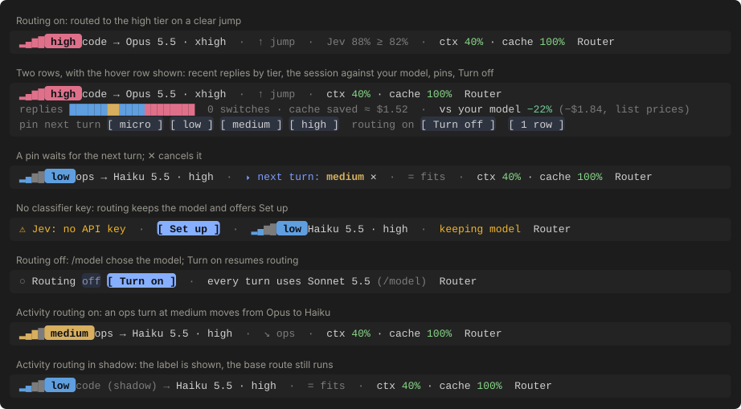
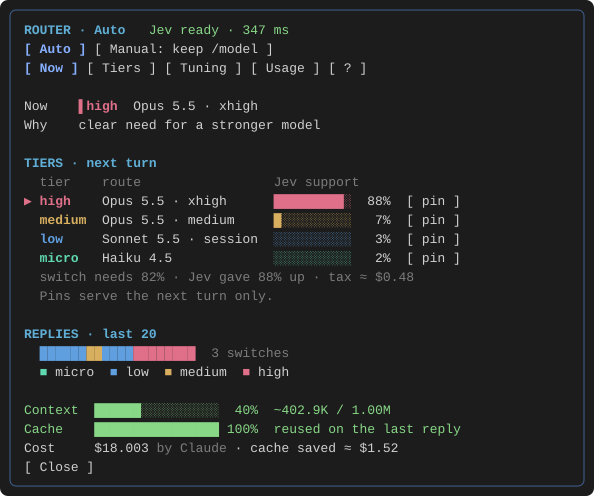
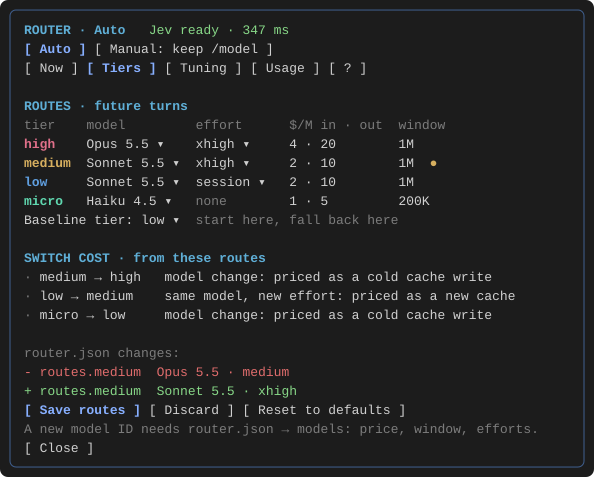

# User guide

## Start a session

Install the plugin from its marketplace, or load a checkout with `--plugin-dir /path/to/claude-router`:

```sh
claude plugin marketplace add alexei-led/claude-router
claude plugin install router@alexei-led-claude-router
```

Start with the full baseline model so Auto mode has a known starting point:

```sh
claude --model claude-sonnet-5-5
```

In Claude Code:

1. Run `/plugin configure router`.
2. Select the Jev API key option, enter the key, and save it.
3. Check the band above the prompt: `▂▄▆█ Auto · ready`. On another model the session starts in Manual; run `/router auto` to route.

The key is stored as a sensitive plugin option. Do not paste it into a model conversation. The [configuration guide](configuration.md) covers optional settings and the old v0.8 migration.

## Read the status band

Router draws one line above the prompt. The line ends with a **Router** button that opens the pane. When the band is narrow, the less important parts drop first: classifier figures, then context and cache, then the reason. The tier and model always stay.



Read the first line of the picture from left to right:

- **Tier meter** `▂▄▆█`: one bar per tier, lit up to the current tier in its color, like signal strength.
- **Tier and model**: the route for this turn. **fallback** means Claude Code answered with another model.
- **Reason**: one or two words with a direction, such as `↑ jump`, `↓ downgrade`, `= fits`, or `… waiting to go down`.
- **Classifier support**: what Jev gave the switch against the bar the policy required.
- **ctx** and **cache**: context use and cache reuse on the last reply. They turn yellow at 60% context and red at 80%.

| Band shows                                  | Meaning                                                                               |
| ------------------------------------------- | ------------------------------------------------------------------------------------- |
| `Auto · ready`                              | Auto mode is ready for a new turn.                                                    |
| `choosing for this turn…`                   | The classifier and local policy are running. The spinner says `Choosing model`.       |
| `⏵ next turn: high ✕`                       | A pin is set. **✕** cancels it.                                                       |
| `⚠ Jev key not set · keeping model`         | No key is available. **Set key** opens the secure plugin dialog.                      |
| `⚠ Jev timed out · keeping model`           | The classifier failed: timed out, unreachable, rejected the key, or paused.           |
| `○ Router off · keeping …`                  | Manual mode. **Auto** resumes routing. The footer also shows `router off`.            |
| `✕ Router unavailable`                      | Nothing routes: an old Claude Code or leftover v0.8 settings. **Fix** opens the pane. |
| `○ Router · subagents keep their own model` | You are viewing a subagent's transcript, which Router does not route.                 |

Hover over the band for a second row: pin a tier for the next turn, switch to Manual, or show two rows. The two-row band adds a strip of recent replies colored by tier, the switch count, the switch tax, and the cache saving. Router remembers that choice across sessions. When Router changes the model between turns, a toast shows the old and new model and the reason. A pin does not raise one.

The band steps aside while a survey needs the space.

Tool continuations do not trigger another classification. Subagent choices remain unchanged.

## Open the router pane

Run `/router` or select **Router** above the prompt. Without a UI surface, as in `claude -p`, `/router` prints a short status instead. The pane has four tabs. Select a tab or press its digit while the pane has focus.



The **Now** tab answers "what runs next turn, and why". The ladder lists the tiers from strongest to cheapest with the route each one uses. The bar is the support the classifier gave that tier on the last turn. The line under the ladder compares the support for a switch with the bar the policy required and shows the estimated switch tax. **pin** forces that tier for the next turn only.



The **Tiers** tab edits the routes. In the picture, `medium` was changed to Sonnet 5.5 at `xhigh`: the tier shows **●**, the switch-cost lines now price `medium → high` as a model change, and the diff lists the one `router.json` line that **Save routes** will write. [Edit tiers](#edit-tiers) explains the controls.

| Tab        | What it shows                                                                                                                           |
| ---------- | --------------------------------------------------------------------------------------------------------------------------------------- |
| 1 Now      | The current tier, model, and reason; Jev's support for each tier with a **pin** button; the last 30 replies by tier; context and cache. |
| 2 Tiers    | The model and effort for each tier, the baseline tier, the cache cost of each step up, and the `router.json` change to save.            |
| 3 Tuning   | Jev deadline, downgrade votes, payback horizon, credits cap, the Jev key, and the `router.json` path.                                   |
| 4 Usage    | Claude-reported cost, context and cache detail, input per reply, quota, and configured-price estimates.                                 |

**Auto** and **Manual: keep /model** stay at the top of every tab. **?** shows what the estimates leave out.

### Understand usage and estimates

- **Cost** comes from Claude Code's native usage API. If the account is on a plan, a configured list-price estimate is not the subscription cash charge.
- **Context** compares the larger available context reading with the routed model's configured window. The router reserves 20% of that window. Values can be unknown when Claude does not provide the needed estimate.
- **Cache** reuse is cache-read tokens divided by the last response's input counters.
- **Jev support** is the probability Jev gave each tier on the last classified turn. The line under it compares the support for a switch with the bar the policy required, and shows the estimated switch tax.
- **Replies** colors each of the last 30 main-conversation replies by the tier that served it. A dot marks a reply the router did not choose, such as one in Manual mode.
- **Input per reply** scales the last 30 input sizes from the lowest to the highest reading. It is a scale comparison, not a forecast.
- **Cache read benefit** is a configured-price estimate for cached reads before write costs. It is not a measured saving.
- **Next-turn difference** compares the candidate with the current model under five-minute and one-hour cache-write scenarios. A negative number means the candidate is estimated to cost less for that request.
- **Payback** estimates later turns to recover an initial difference under assumed future cache reads and the last observed output size. It does not guarantee savings.

There is no router-side spend or savings ledger. The pane does not include Jev charges. Claude's native `/cost` is the source for its reported API cost.

## Change routing

| Command or action                        | Result                                                                      |
| ---------------------------------------- | --------------------------------------------------------------------------- |
| `/router`                                | Open the pane.                                                              |
| `/router auto`                           | Resume automatic routing.                                                   |
| `/router off`                            | Enter Manual mode and preserve Claude's selected model.                     |
| `/router pin <micro\|low\|medium\|high>` | Pin the next turn and its tool continuations. Auto must already be enabled. |
| `/model <name>`                          | Select a model and enter Manual mode. Use `/router auto` to resume.         |
| **Auto** / **Manual: keep /model**       | The same as `/router auto` and `/router off`.                               |
| **pin** on the Now tab                   | Pin that tier for the next turn. Auto must already be enabled.              |

A pin does not change the next turn after the pinned turn finishes. A fresh session on the baseline model starts in Auto. A fresh session on another model starts in Manual. `/clear` starts the new session in Auto. Resuming a saved session restores its saved Auto or Manual mode.

## Edit tiers

On the **Tiers** tab, pick a model and an effort for any tier. The model list comes from the aliases in `router.json` `models`, limited by the `availableModels` setting. `session` keeps the effort Claude Code sends. A model without effort levels, such as Haiku, shows `none`.

Changed tiers show **●**. The tab lists the `router.json` lines that **Save routes** will write. **Discard** drops the draft. **Reset to defaults** loads the built-in routes; saving then removes your route overrides from `router.json`. A saved change applies from the next turn.

**Switch cost** reads the draft from the bottom tier up and shows how the policy prices each step. A model change is priced as a cold cache write. An effort change on the same model is also priced as a new messages cache; whether the API actually keeps the cache across an effort change is not measured. Two identical tiers make that step change nothing.

A new model ID needs an entry in `router.json` `models` with its price, context window, and effort levels. See [Configuration](configuration.md).

## Tune future decisions

On the **Tuning** tab, pick the values, then select **Save tuning**:

- **Jev deadline:** 500, 1,000, 1,500, or 3,000 ms for the total advice attempt, including any retry.
- **Votes to go down:** 1, 2, or 3 consecutive votes before a cheaper tier.
- **Payback horizon:** 1, 3, 5, or 10 later turns used by the downgrade estimate.
- **Credits cap:** $0.50, $1, $2, or $5 for an estimated cold cache write on a `credits` model.

The current turn keeps the settings it started with. A save preserves unrelated `router.json` keys and refuses to write through a symlink. When validation fails, the pane names the setting and leaves the file unchanged. **Set Jev key** or **Edit key** opens Claude Code's secure plugin configuration.

## Move from v0.8 gateway setup

The v1 plugin has the same plugin ID, `router@alexei-led-claude-router`, but it does not start the v0.8 local gateway. With auto-update on, Claude Code installs v1 at the next start. Before the first v1 session:

1. Update the plugin: `claude plugin marketplace update alexei-led-claude-router`, then `claude plugin update router@alexei-led-claude-router`.
2. Remove the settings that v0.8 `/router:setup` wrote. The [migration checklist](configuration.md#convert-a-v08-configuration) lists them: the `jev-router[1m]` model and picker row, the loopback `ANTHROPIC_BASE_URL`, the hint header, and the router status line.
3. Convert `router.json` if you created one.
4. Restart Claude Code with a full baseline model, such as `claude-sonnet-5-5`.

Keep the plugin enabled: in v1 it is the Mod. The Jev key option keeps its saved value. If the band reads `v0.8 gateway settings remain`, step 2 is incomplete.

## Update or stop

Claude Code updates a marketplace install at startup when auto-update is on for the marketplace. To update now, run `claude plugin marketplace update alexei-led-claude-router`, then `claude plugin update router@alexei-led-claude-router`, and restart. For a local checkout, update the files and restart Claude Code with the same `--plugin-dir`.

To stop routing for a session, run `/router off`. To stop loading the Mod, run `claude plugin disable router@alexei-led-claude-router`, or restart without `--plugin-dir` for a checkout. The Mod keeps no session ledger and starts no process.

## Troubleshooting

| Symptom                                   | Cause                                                                            | Fix                                                                                                                                                                |
| ----------------------------------------- | -------------------------------------------------------------------------------- | ------------------------------------------------------------------------------------------------------------------------------------------------------------------ |
| Status says the Jev key is missing        | The plugin option is unset or unavailable to this process.                       | Select **Set Jev key** in the pane, or run `/plugin configure router`. Save the option and start a new turn.                                                       |
| Route stays on the current model          | Jev timed out, failed, is paused, or network policy refused the request.         | Read the status band and the pane header. Network policy refusal is not bypassed.                                                                                  |
| `/model` changed but routing stopped      | Choosing a model enters Manual mode.                                             | Run `/router auto` to resume automatic routing.                                                                                                                    |
| Router reports invalid configuration      | `router.json` is invalid, or project/local settings redirect the router profile. | Inspect `router.json`, remove project/local `HOME` or `CLAUDE_CONFIG_DIR` overrides, or run the [migration command](configuration.md#convert-a-v08-configuration). |
| Router says old settings need migration   | `router.json` still contains v0.8 gateway keys.                                  | Run the [migration command](configuration.md#convert-a-v08-configuration).                                                                                         |
| Band reads `v0.8 gateway settings remain` | The `jev-router[1m]` model or the `127.0.0.1:43170` base URL is still set.       | Run `/router`: it lists the keys. Remove them as in the [migration checklist](configuration.md#convert-a-v08-configuration) and restart.                           |
| Router controls are unavailable           | Claude Code is older than 2.1.289.                                               | Update Claude Code.                                                                                                                                                |
| Context reads as unknown                  | The router lacks a reliable local estimate or current-history measurement.       | Keep using the current model, or start a new history with a supported context estimate.                                                                            |

For the internal event flow and network deadline behavior, see [Architecture](architecture.md). For what the test traces do and do not show, see [Evaluation](evaluation.md).
