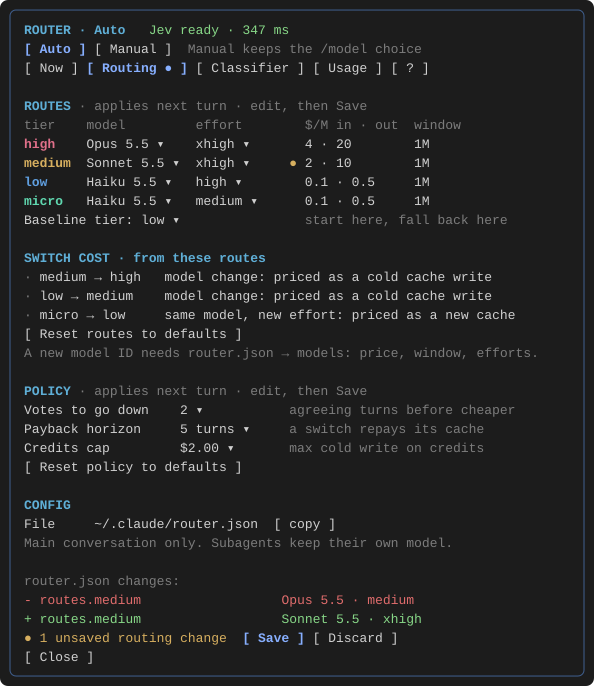
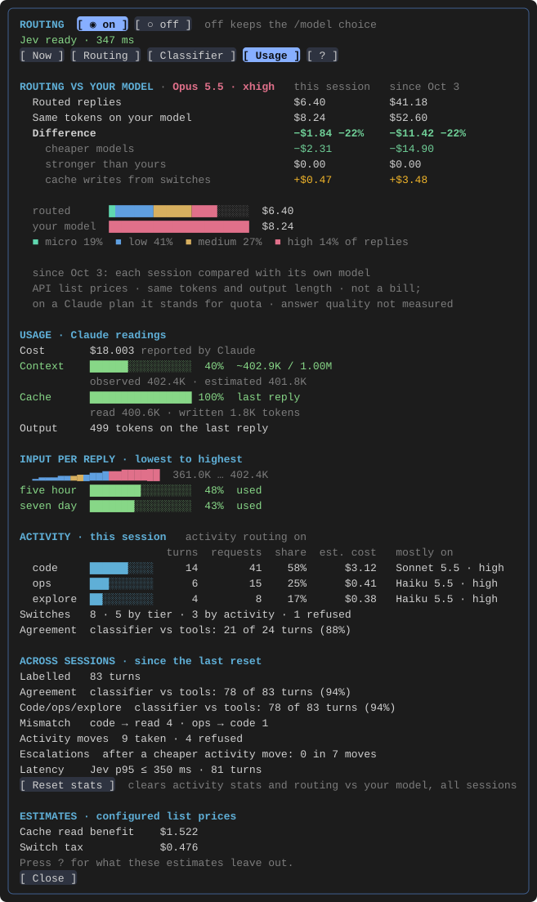
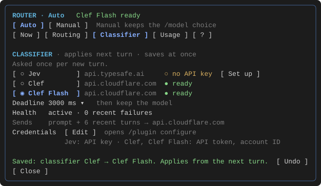

# User guide

## Start a session

Install the plugin from its marketplace, or load a checkout with `--plugin-dir /path/to/claude-router`:

```sh
claude plugin marketplace add alexei-led/claude-router
claude plugin install router@alexei-led-claude-router
```

Start with the full baseline model so routing has a known starting point:

```sh
claude --model claude-haiku-5-5
```

In Claude Code:

1. Run `/plugin configure router`.
2. Enter the credentials of the classifier you use, and save them:
   - **Jev** (the default): the Jev API key from typesafe.ai.
   - **Clef** or **Clef Flash** on Cloudflare Workers AI: the Cloudflare API token and the Cloudflare account ID. One token covers both models.
   - **OpenAI**: an OpenAI API key. The prompt text goes to OpenAI.
   - **Ollama**: no credential. Run `ollama serve` and pull the model; the prompt text stays on this machine.
3. To use another classifier, open the pane's **Classifier** tab and select its row. See [Choose the classifier](#choose-the-classifier).
4. Check the band above the prompt: `Routing on · ready`. On a model that no tier routes to, the session starts with routing off and the band says why; run `/router auto` to route.

Keys are stored as sensitive plugin options. Do not paste them into a model conversation. The [configuration guide](configuration.md) covers optional settings and migrations.

## Read the status band

Router draws one line above the prompt. The line ends with a **Router** button that opens the pane. When the band is narrow, the less important parts drop first: classifier figures, then context and cache, then the activity, then the reason. The tier and model always stay, except behind a classifier warning: the warning and its **Set up** button come first, and the route gives way to them.


Read the first line of the picture from left to right:

- **Tier meter** `▂▄▆█`: one bar per tier, lit up to the current tier in its color, like signal strength.
- **Tier, activity, and model**: the route for this turn. The activity, such as `code →`, sits between the tier and the model; see [Route by activity](#route-by-activity). **fallback** means Claude Code answered with another model.
- **Reason**: one or two words with a direction, such as `↑ jump`, `↓ downgrade`, `= fits`, or `… waiting to go down`. An activity move reads `↗ code` or `↘ ops`, and a refused one `… ops: not worth a switch`.
- **Classifier support**: what the active classifier, such as Jev or Clef Flash, gave the switch against the bar the policy required.
- **ctx** and **cache**: context use and cache reuse on the last reply. They turn yellow at 60% context and red at 80%.

| Band shows                                  | Meaning                                                                                                                  |
| ------------------------------------------- | ------------------------------------------------------------------------------------------------------------------------ |
| `Routing on · ready`                        | Routing is on and ready for a new turn.                                                                                  |
| `choosing for this turn…`                   | The classifier and local policy are running. The spinner says `Choosing model`.                                          |
| `⏵ next turn: high ✕`                       | A pin is set. **✕** cancels it.                                                                                          |
| `⚠ Jev: no API key · keeping model`         | The active classifier lacks a setting. **Set up** opens the secure plugin dialog.                                        |
| `⚠ Clef: no account ID · keeping model`     | Clef has its API token but no Cloudflare account ID. **Set up** opens the dialog.                                        |
| `⚠ Jev timed out · keeping model`           | The classifier failed: timed out, unreachable, rejected the key, or paused.                                              |
| `○ Routing off · every turn uses …`         | Routing is off: Claude's model answers every turn. **Routing on** turns it back on. The footer also shows `routing off`. |
| `✕ Routing unavailable`                     | Nothing routes: an old Claude Code or leftover v0.8 settings. **Fix** opens the pane.                                    |
| `○ Router · subagents keep their own model` | You are viewing a subagent's transcript, which Router does not route.                                                    |

The band's **Routing off** button turns routing off, and **Routing on** turns it back on. Hover over the band for a second row: pin a tier for the next turn, or show two rows. The two-row band adds a strip of recent replies colored by tier, the switch count, the switch tax, the cache saving and, from the tenth reply, the session against your model, such as `vs your model −22% (−$1.84, list prices)` or `vs your model +$2.48 (stronger models, list prices)`. It drops first when the row is short. Router remembers that choice across sessions. When Router changes the model between turns, a toast reads `Model changed: old → new · reason`. A pin does not raise one, and neither does a change of effort alone.

The band steps aside while a survey needs the space.

Tool continuations do not trigger another classification. Subagent choices remain unchanged.

## Open the router pane

Run `/router` or select **Router** above the prompt. Without a UI surface, as in `claude -p`, `/router` prints a short status instead. The pane has four tabs. Select a tab or press its digit while the pane has focus.


The **Now** tab answers "what runs next turn, and why". The ladder lists the tiers from strongest to cheapest with the route each one uses. The bar is the support the classifier gave that tier on the last turn. The line under the ladder compares the support for a switch with the bar the policy required and shows the estimated switch tax. **pin** forces that tier for the next turn only. The **Activity** and **Route** lines under the route are covered in [Route by activity](#route-by-activity).



The **Routing** tab edits the routes, the activity overrides, and the policy. In the picture, `medium` was changed to Sonnet 5.5 at `xhigh`: the tier shows **●**, the tab reads **Routing ●**, the switch-cost lines now price `medium → high` as a model change, and the status bar lists the `router.json` lines that **Save** will write. The same picture shows the activity matrix and overrides, with a `code` override at `high` added. [Edit routes and policy](#edit-routes-and-policy) explains the controls.

| Tab          | What it shows                                                                                                                                                                                        |
| ------------ | ---------------------------------------------------------------------------------------------------------------------------------------------------------------------------------------------------- |
| 1 Now        | The current tier, model, activity, and reason; the classifier's support for each tier with a **pin** button; the last 30 replies by tier and activity; context and cache.                            |
| 2 Routing    | The model and effort for each tier, the baseline tier, the cache cost of each step up; the activity matrix and overrides; downgrade votes, payback horizon, and credits cap; the `router.json` path. |
| 3 Classifier | The classifier rows with their credentials state, the active classifier's deadline and health, and the credentials each classifier needs.                                                            |
| 4 Usage      | Routing vs your model; Claude-reported cost, context and cache detail, input per reply, quota, activity counts for this session and across sessions, and configured-price estimates.               |

**Routing on** and **Routing off** stay at the top of every tab. **?** shows what the estimates leave out.

### Save and undo changes

The two settings tabs follow one rule each, and the section captions say which:

- **Routing**: edit as a set, then save. Changes stay a draft until **Save** (`s`). **Discard** (`d`) drops them. The draft stays when you change tab or close the pane: the tab reads **Routing ●**, and every tab shows the `router.json` lines that **Save** will write, with **Save** and **Discard**. A new session drops the draft.
- **Classifier**: a row or a deadline is written to `router.json` when you select it.

Every write applies from the next turn and can be undone. **Undo** (`u`) puts back the settings the last write changed, from any tab, and leaves any other edit to `router.json` alone. A new session clears it. Green notices confirm a write or an undo; a red one names why nothing was written.

### Compare routing with your model



**ROUTING VS YOUR MODEL** opens the Usage tab. Your model is the model and effort the session had before routing: the `--model` or `/model` choice and the session effort, shown in the heading. For every reply routing chose, it prices the tokens Claude reported on the model that served them, and the same tokens on your model, at the list prices in `router.json`.

| Line                       | What it is                                                                                                                                  |
| -------------------------- | ------------------------------------------------------------------------------------------------------------------------------------------- |
| Routed replies             | What the routed replies cost on the models that served them.                                                                                |
| Same tokens on your model  | What the same input and output tokens cost on your model, with one cache that never switched.                                              |
| Difference                 | Routed minus yours. Green with a percentage when routing cost less; amber with `+$` when it cost more, `×N` once it is twice yours or more. |
| cheaper models             | The part from replies on models cheaper than yours.                                                                                         |
| stronger than yours        | The part from replies on stronger models, with how many replies ran on them.                                                                |
| cache writes from switches | The part from rewriting the prompt cache after model switches.                                                                              |

The three parts add up to the difference. Two bars compare the costs, the routed one colored by the tier that spent it, and a line gives the share of replies per tier. In activity-routing `shadow`, one more line estimates what `on` would change in this session. The columns are this session and every session since the last reset. A column reads `too early` until it has 10 routed replies. With routing off or unavailable and no routed reply this session, the section says every reply used your model. In a narrow pane the bars go first, then the saved column.

These are estimates, not a bill. They hold the tokens and the output length the same, although another model may write more or less, and they do not measure answer quality. On a Claude plan the dollars stand for quota. Your model's cache reads the previous prompt inside the cache lifetime Claude Code uses, one hour on a Claude plan, and never less than the API actually read. A route that changes only the effort, such as Opus at `xhigh` to Opus at `medium`, costs no less per token: it shows only its cache writes. [Evaluation](evaluation.md#routing-vs-your-model) explains the method.

### Understand usage and estimates

- **Cost** comes from Claude Code's native usage API. If the account is on a plan, a configured list-price estimate is not the subscription cash charge.
- **Context** compares the larger available context reading with the routed model's configured window. The router reserves 20% of that window. Values can be unknown when Claude does not provide the needed estimate.
- **Cache** reuse is cache-read tokens divided by the last response's input counters.
- **Classifier support**, such as **Jev support**, is the probability the classifier gave each tier on the last classified turn. The line under it compares the support for a switch with the bar the policy required, and shows the estimated switch tax.
- **Replies** colors each of the last 30 main-conversation replies by the tier that served it. A dot marks a reply the router did not choose, such as one with routing off. When activity routing is on or in shadow, a row of letters under the strip names each reply's activity: `c` code, `d` debug, `e` explore, `p` plan, `r` review, `o` ops, `w` docs.
- **Input per reply** scales the last 30 input sizes from the lowest to the highest reading. It is a scale comparison, not a forecast.
- **Cache read benefit** is a configured-price estimate for cached reads before write costs. It is not a measured saving.
- **Next-turn difference** compares the candidate with the current model under five-minute and one-hour cache-write scenarios. A negative number means the candidate is estimated to cost less for that request.
- **Payback** estimates later turns to recover an initial difference under assumed future cache reads and the last observed output size. It does not guarantee savings.

The router keeps no bill. Routing vs your model is an estimate at configured list prices. The pane does not include classifier charges. Claude's native `/cost` is the source for its reported API cost.

## Route by activity

A tier says how hard the work is. The activity says what kind of work it is. The classifier names it for each new turn, by what the turn produces:

| Activity  | The turn produces                                               |
| --------- | --------------------------------------------------------------- |
| `code`    | Changed code or config, including tests                         |
| `debug`   | A found cause: failing tests, stack traces, "why does X..."     |
| `explore` | An answer: explain code, find where something happens, research |
| `plan`    | A decision or plan: design, task breakdown, trade-offs          |
| `review`  | Findings about existing code: a PR, a diff, an audit            |
| `ops`     | Executed commands: git, builds, test runs, CI, deploys          |
| `docs`    | Prose for people: README, docs, comments, commit messages       |

A mixed turn such as "fix it and commit" takes the hardest part, here `code`. The router then picks the route by tier and activity. With activity routing on and the default overrides, a `low` coding turn runs on Sonnet 5.5 at `medium`, while a `low` git turn stays on Haiku 5.5 at `high`. [Configuration](configuration.md#activity-routing) has the full matrix and how to change it.

The mode decides what happens with the label:

| Mode     | What the router does                                                                                                               |
| -------- | ---------------------------------------------------------------------------------------------------------------------------------- |
| `off`    | Asks nothing new. The routes are the tier routes.                                                                                  |
| `shadow` | The default. Shows the activity, records the stats, and works out what `on` would run. The tier route still runs; nothing changes. |
| `on`     | Applies the activity overrides. This is opt-in: run `/router activities on`.                                                       |

In `shadow` you can see what `on` would do before you switch it on. The band marks the label `(shadow)` and dims it, and the **Now** tab says `low + code would use Sonnet 5.5 · medium (shadow; using Haiku 5.5 · high)`, or `same route` when both agree. In `on` the **Now** tab reads `low + code → Sonnet 5.5 · medium (override)` with the tier's base route next to it, or `(base)` when the cell has no override.

How the router moves inside a tier:

- It compares routes, not labels. If the new activity resolves to the route already running, nothing switches.
- A move to a stronger route needs the classifier's support, as an upgrade between tiers does. A move to a cheaper one must pay back its cache write within the payback horizon. One vote is enough for either, because the activity is a fact about this turn.
- An activity applies only when the classifier gives it at least 60% probability (`policy.activityMass`). Below that, or on `uncertain`, the turn goes back to its tier's route, if the move passes the same checks. Tool continuations inside a turn keep the turn's route. When the classifier sees a new prompt as a continuation of the task, the activity may only move to a stronger route: `explore` can become `code`, but not the other way. Ollama does not answer the continuation question, so this rule does not apply to it.
- A pinned turn uses the pin's tier route and shows no activity.
- When the classifier gives no answer at all (a timeout, a failure, a pause, or a missing key), the running route stays. When it answers the tier but gives no usable activity, only the running activity stays: the tier answer still applies, so the turn can change tier and keeps its activity there. In `shadow` and `off` the tier route always runs, as in 1.5.
- A fresh session starts with routing on when the session model is a tier's route. With activity routing `on`, a model that only an activity override uses also counts: Sonnet 5.5 on the defaults. In `off` and `shadow` it does not.

The band's activity label appears only when the activity applies, so a weak or `uncertain` answer shows none. The two-row band and the **Replies** strip show the activities of recent replies.

### Read the activity on the pane

- **Now**: the **Activity** line names the classifier's choice with its share and the two next-best answers, such as `code 84%   debug 8% · plan 5%`. The **Route** line shows the route the cell resolves to. **Replies** has a letter row under the strip.
- **Routing**: the **ACTIVITIES** matrix shows the effective routes per tier, with `·` where a cell uses the tier's route, and counts the distinct routes, because each is its own cache. **OVERRIDES** lists each override with a model, an effort, and **remove**, plus a selector to add one and the mode selector. Edits join the routing draft: **Save** and **Discard** apply as for routes. Yellow notes flag an override with no effect (`same as base`), one stronger than the tier above, and one that adds a cache.
- **Usage**: **ACTIVITY · this session** lists turns, requests, and share per activity, the switches split by tier and by activity, and **Agreement**, how often the tools a turn used fit the classifier's activity (see [Evaluation](evaluation.md#tool-agreement)). In `shadow` the **Shadow** line counts how many turns `on` would have routed differently, such as `on would route 5 of 20 turns differently · est. −$0.300 … −$0.120 at list prices`. The estimate sums, over those turns, what the next request on the route `on` would use would cost against the route that ran, as a low and a high scenario at the configured list prices in `router.json`. Minus means cheaper. It covers only turns after a measured reply, and adds `for 3` when only three of the turns have one. It is not a measured saving.

**ACROSS SESSIONS · since the last reset** shows the counts kept across sessions: the turns labelled from their tools, **Agreement** over them, **Code/ops/explore**, the same agreement over the turns the classifier answered `code`, `ops` or `explore` (omitted when there are none), the two most frequent mismatches as `predicted → observed count` (`code → read 3`), lateral switches taken and refused, and the **Shadow** line summed over all shadow turns. This agreement compares the classifier's raw answer, so it can differ from the session's. The pane reads these counts when the session starts and when it opens, and after each turn. **Reset stats** clears the activity counts and routing vs your model, for this session and across sessions.

`/router` without a UI surface adds an `Activity: ops (81%)` line, the resolved route, and `Agreement across sessions: 19 of 22 turns (86%) · code/ops/explore 9 of 10 (90%)`. It also prints the session against your model, such as `vs your model (Opus 5.5 · xhigh): −$1.84 (−22%) this session, 64 replies, est. at list prices`.

## Change routing

| Command or action                        | Result                                                                                                    |
| ---------------------------------------- | --------------------------------------------------------------------------------------------------------- |
| `/router`                                | Open the pane.                                                                                            |
| `/router auto`                           | Resume automatic routing.                                                                                 |
| `/router off`                            | Turn routing off and keep Claude's selected model.                                                        |
| `/router pin <micro\|low\|medium\|high>` | Pin the next turn and its tool continuations. Routing on must already be enabled.                         |
| `/router activities <off\|shadow\|on>`   | Set the [activity routing](#route-by-activity) mode. Saved to `router.json` at once; **Undo** reverts it. |
| `/model <name>`                          | Select a model and turn routing off. Use `/router auto` to turn it back on.                               |
| **Routing on** / **Routing off**         | The same as `/router auto` and `/router off`.                                                             |
| **pin** on the Now tab                   | Pin that tier for the next turn. Routing on must already be enabled.                                      |

A pin does not change the next turn after the pinned turn finishes. A fresh session on a model that one of the tiers routes to starts with routing on. A fresh session on any other model starts with routing off. `/clear` starts the new session with routing on. Resuming a saved session restores its saved routing on or off.

## Edit routes and policy

On the **Routing** tab, pick a model and an effort for any tier. The model list comes from the aliases in `router.json` `models`, limited by the `availableModels` setting. `session` keeps the effort Claude Code sends. A model without effort levels, such as a custom one with `"efforts": []`, shows `none`.

Changed tiers and overrides show **●**. **Reset routes to defaults** (`r`) loads the built-in routes into the draft; **Save** then removes your route overrides from `router.json`.

**Switch cost** reads the draft from the bottom tier up and shows how the policy prices each step. A model change is priced as a cold cache write. An effort change on the same model is also priced as a new messages cache; whether the API actually keeps the cache across an effort change is not measured. Two identical tiers make that step change nothing.

A new model ID needs an entry in `router.json` `models` with its price, context window, and effort levels. See [Configuration](configuration.md).

### Tune future decisions

Under **Policy** on the same tab, pick the values. One **Save** writes them with any route changes:

- **Votes to go down:** 1, 2, or 3 consecutive votes before a cheaper tier. A new or reset history needs one.
- **Payback horizon:** 1, 3, 5, or 10 later turns used by the downgrade estimate.
- **Credits cap:** $0.50, $1, $2, or $5 for an estimated cold cache write on a `credits` model.

**Reset policy to defaults** loads the built-in values; **Save** then removes your policy overrides. The current turn keeps the settings it started with. A save preserves unrelated `router.json` keys and refuses to write through a symlink. When validation fails, the pane names the setting and leaves the file unchanged.

## Choose the classifier

Router asks one classifier per turn. Five are built in:

| Classifier | Service                    | Credentials                                    | Deadline |
| ---------- | -------------------------- | ---------------------------------------------- | -------: |
| Jev        | typesafe.ai                | Jev API key                                    | 1,500 ms |
| Clef       | Cloudflare Workers AI, 27B | Cloudflare API token and Cloudflare account ID | 3,000 ms |
| Clef Flash | Cloudflare Workers AI, 9B  | Cloudflare API token and Cloudflare account ID | 3,000 ms |
| OpenAI     | OpenAI, `gpt-6-luna`       | OpenAI API key                                 | 3,000 ms |
| Ollama     | Local Ollama, `qwen3.5:9b` | None                                           | 5,000 ms |



You can save credentials for all of them; only the active one is asked. The **Classifier** tab has one row per classifier: `◉` marks the active one, followed by its service and whether its credentials are complete. A row that lacks one names it, such as `○ no API token`, and has its own **Set up** button.

Select a row to switch. The choice is written to `router.json` at once and applies from the next turn. **Undo** in the status bar returns to the previous classifier. A turn that is already being classified finishes with the classifier it started with. The new classifier starts with a clean failure count.

- **Deadline:** 500, 1,000, 1,500, 3,000, or 5,000 ms for the active classifier's total advice attempt, including any retry. Each classifier keeps its own deadline, saved at once, with **Undo**.
- **Health** shows recent failures or a pause. **Sends** names the service that receives prompt text.
- **Credentials** lists what each classifier needs, such as `Jev: API key · Clef, Clef Flash: API token, account ID · OpenAI: API key · Ollama: no key needed`. **Edit** opens Claude Code's secure plugin configuration, where you enter them.

With `shadow` or `on`, the activity question goes in the same request as the tier question (Ollama makes a second call), with the same text and nothing more. **Sends** names the service that receives the prompt and recent dialogue. With Clef or Clef Flash that is Cloudflare, not typesafe.ai; with OpenAI it is OpenAI; with Ollama it stays on this machine. Give the Cloudflare token Workers AI permissions only.

The routing policy thresholds were tuned against Jev's probabilities. Clef's, OpenAI's, and Ollama's probabilities have not been compared with Jev's, so the same prompt can switch tiers at a different point. Watch **Classifier support** for a few sessions before you rely on a new classifier.

### Use Ollama

Ollama runs the classifier on this machine, so the prompt text does not leave it. It needs no key.

1. Install Ollama and pull a model: `ollama pull qwen3.5:9b`.
2. Start the server: `ollama serve`. The router calls `http://127.0.0.1:11434`.
3. On the pane's **Classifier** tab, select the **Ollama** row, or set `"classifier": "ollama"` in `router.json`.

The model is the `model` field of `classifiers.ollama` in [Configuration](configuration.md#ollama). To use another tag, pull it and set `"classifiers": { "ollama": { "model": "<tag>" } }`.

## Move from v0.8 gateway setup

The v1 plugin has the same plugin ID, `router@alexei-led-claude-router`, but it does not start the v0.8 local gateway. With auto-update on, Claude Code installs v1 at the next start. Before the first v1 session:

1. Update the plugin: `claude plugin marketplace update alexei-led-claude-router`, then `claude plugin update router@alexei-led-claude-router`.
2. Remove the settings that v0.8 `/router:setup` wrote. The [migration checklist](configuration.md#convert-a-v08-configuration) lists them: the `jev-router[1m]` model and picker row, the loopback `ANTHROPIC_BASE_URL`, the hint header, and the router status line.
3. Convert `router.json` if you created one.
4. Restart Claude Code with a full baseline model, such as `claude-haiku-5-5`.

Keep the plugin enabled: in v1 it is the Mod. The Jev key option keeps its saved value. If the band reads `v0.8 gateway settings remain`, step 2 is incomplete.

## Update or stop

Claude Code updates a marketplace install at startup when auto-update is on for the marketplace. To update now, run `claude plugin marketplace update alexei-led-claude-router`, then `claude plugin update router@alexei-led-claude-router`, and restart. For a local checkout, update the files and restart Claude Code with the same `--plugin-dir`.

To stop routing for a session, run `/router off`. To stop loading the Mod, run `claude plugin disable router@alexei-led-claude-router`, or restart without `--plugin-dir` for a checkout. The Mod keeps no session ledger and starts no process.

## Troubleshooting

| Symptom                                     | Cause                                                                            | Fix                                                                                                                                                                |
| ------------------------------------------- | -------------------------------------------------------------------------------- | ------------------------------------------------------------------------------------------------------------------------------------------------------------------ |
| Status says `no API key` or `no API token`  | The active classifier's plugin option is unset or unavailable to this process.   | Select **Set up** in the pane, or run `/plugin configure router`. Save the option and start a new turn.                                                            |
| Status says `no account ID`                 | Clef or Clef Flash is active without the Cloudflare account ID.                  | Run `/plugin configure router` and save the Cloudflare account ID.                                                                                                 |
| Route stays on the current model            | The classifier timed out, failed, is paused, or network policy refused it.       | Read the status band and the pane header. Network policy refusal is not bypassed.                                                                                  |
| `/model` changed but routing stopped        | Choosing a model turns routing off.                                              | Run `/router auto` to turn routing back on.                                                                                                                        |
| Router reports invalid configuration        | `router.json` is invalid, or project/local settings redirect the router profile. | Inspect `router.json`, remove project/local `HOME` or `CLAUDE_CONFIG_DIR` overrides, or run the [migration command](configuration.md#convert-an-older-routerjson). |
| Router says old settings need migration     | `router.json` still contains v0.8 gateway keys or the 1.1 `jev` section.         | Run the [migration command](configuration.md#convert-an-older-routerjson).                                                                                         |
| `⚠ OpenAI rejected the key · keeping model` | The OpenAI key is wrong, revoked, or lacks access to `gpt-6-luna`.               | Run `/plugin configure router` and save a valid OpenAI API key.                                                                                                    |
| `⚠ Ollama unreachable · keeping model`      | No Ollama server listens on `127.0.0.1:11434`.                                   | Run `ollama serve`, then start a new turn.                                                                                                                         |
| `⚠ Ollama timed out · keeping model`        | The model is loading after an idle period, or the machine is slow.               | Wait for one more turn. If it recurs, raise `classifiers.ollama.timeoutMs` in `router.json`.                                                                       |
| `⚠ Ollama request failed · keeping model`   | The tag in `model` is not pulled, or Ollama rejected a request setting.          | Run `ollama pull <model>` for the tag in `model`, or choose another model.                                                                                         |
| Band reads `v0.8 gateway settings remain`   | The `jev-router[1m]` model or the `127.0.0.1:43170` base URL is still set.       | Run `/router`: it lists the keys. Remove them as in the [migration checklist](configuration.md#convert-a-v08-configuration) and restart.                           |
| Router controls are unavailable             | Claude Code is older than 2.1.289.                                               | Update Claude Code.                                                                                                                                                |
| Context reads as unknown                    | The router lacks a reliable local estimate or current-history measurement.       | Keep using the current model, or start a new history with a supported context estimate.                                                                            |

For the internal event flow and network deadline behavior, see [Architecture](architecture.md). For what the test traces do and do not show, see [Evaluation](evaluation.md).
